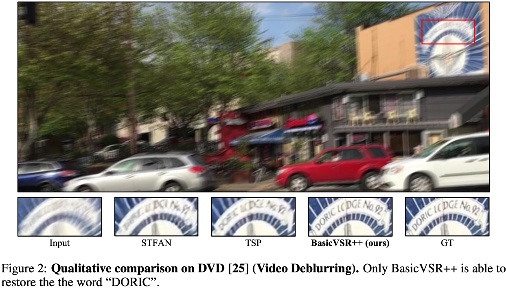

# 学术写作

## 目录

- [学术写作](#学术写作)
  - [目录](#目录)
  - [写作指南](#写作指南)
  - [图表鉴赏](#图表鉴赏)
    - [多变量](#多变量)
    - [美感](#美感)
    - [图文对应](#图文对应)
    - [排列](#排列)

## 写作指南

[[参考]](https://github.com/MLNLP-World/Paper_Writing_Tips)

## 图表鉴赏

### 多变量

如图，一张图表示了三个指标：质量，运行速度，参数量。

### 美感

曲线很好看。

图标可以简练，例如用一个圆圈表示一个卷积层，而无需画成方形。

### 图文对应

文字更简洁严谨，图像更直观。

### 排列

如图展示了一种主观图呈现方式。

