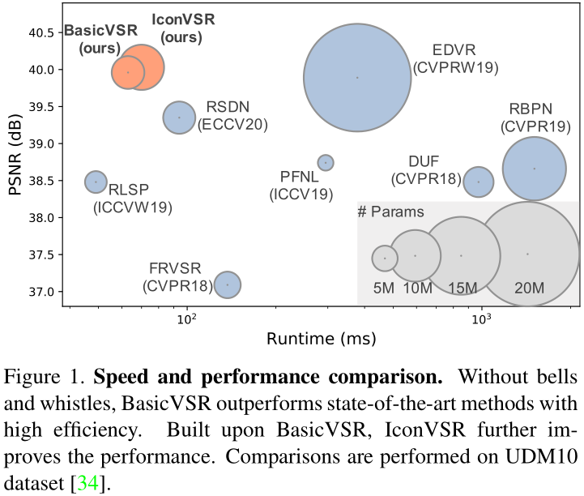
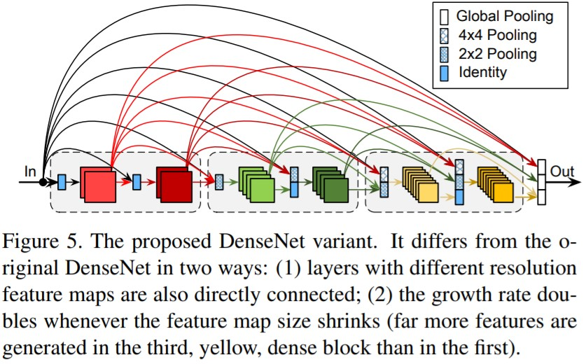
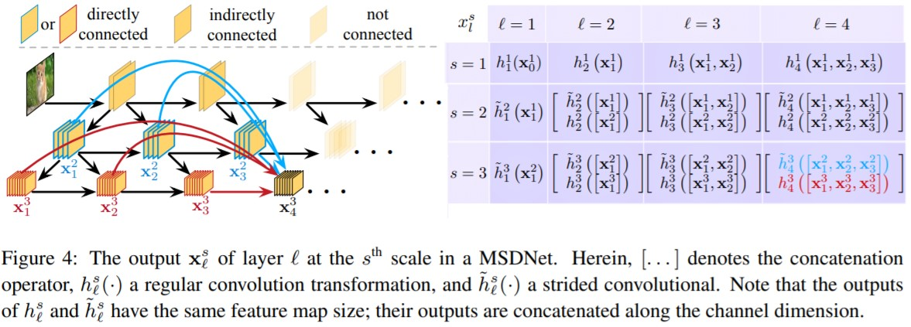
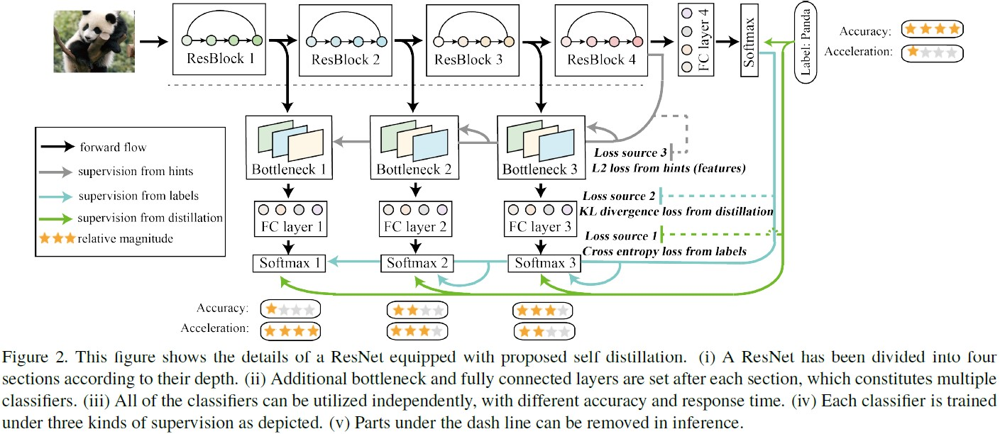

# 学术写作

- [学术写作](#学术写作)
  - [范文参考](#范文参考)
  - [图表鉴赏](#图表鉴赏)

## 范文参考

[Depth-Aware Video Frame Interpolation](https://openaccess.thecvf.com/content_CVPR_2019/papers/Bao_Depth-Aware_Video_Frame_Interpolation_CVPR_2019_paper.pdf)

1. 每一段长度适中。
2. 只讲一个故事：传统MEMC无法处理遮挡；而基于depth可以缓解这一问题。因此，文章特别简洁明了，每一段都是为这个故事服务的。
2. 在方法章节，开篇强调核心贡献，再介绍网络的基本结构，哪怕结构大部分都来源于其他文章。
3. 小瑕疵：标题大小写不统一。建议：HEADING ONE，Heading Two，Heading three。

## 图表鉴赏

信息量要充分，否则别画图表：

如图，一张图表示了三个指标：质量，运行速度，参数量。

布局应具有美感：

这一点没啥好方法，只能多参考多借鉴。

图文可以对应，文字更简洁严谨，图像更直观：

图标可以简练，例如用一个圆圈表示一个卷积层，而无需画成方形：

