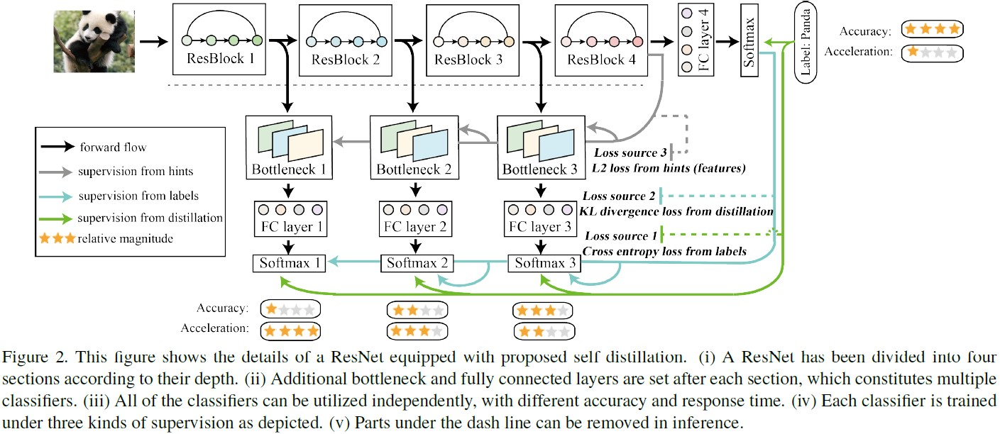

# ART

- [ART](#art)
  - [论文绘图](#论文绘图)

## 论文绘图

<b>字多</b>

用色彩框打底；图标形象；不同字体形态。

<b>带公式</b>

底框；色彩对应。

<b>美感</b>

色彩搭配；曲线布局。

<b>多指标多算法</b>

同时对比性能、FLOPs和参数量。

<b>示意图范例</b>

- 星标级别很有灵性
- 用小圆圈代替卷积层

底框。

