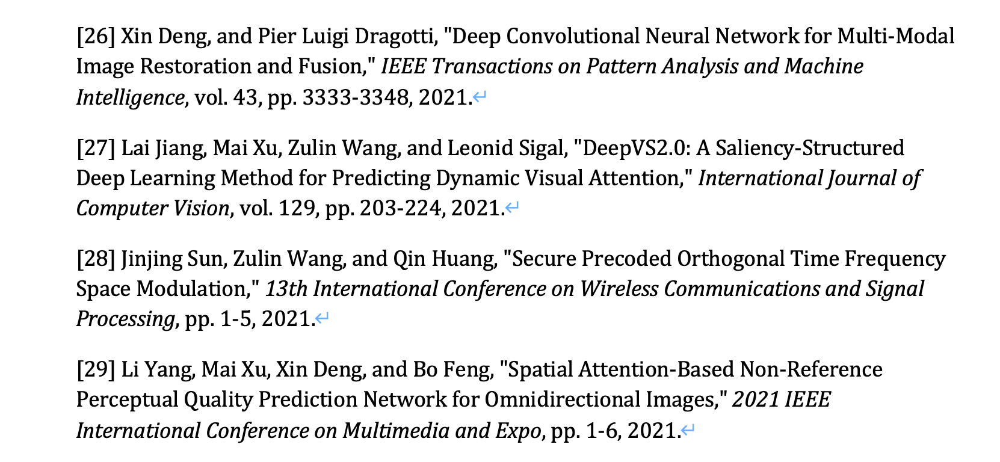

# 统计某作者所有文献并按格式要求导出

本文所有代码、中间文件和最终文件都已上传至 Releases。

## 任务需求和分析

需求：

1. 统计几位老师发表过的所有论文（期刊 + 会议）。
2. 以 Word 文档方式记录条目，按时间顺序排列。
3. 条目格式有要求，如：「\[1\] Xin Deng, Enpeng Liu, Shengxi Li, Yiping Duan, and Mai Xu, "Interpretable multi-modal image registration network based on disentangled convolutional sparse coding," *IEEE Transactions on Image Processing*, vol. 32, pp. 1078-1091, 2023.」

分析：

1. 绝不用人工方式完成任务：否则需求一改，一切都要推倒重来。
2. 任务有一定自由度：文献列表只需要尽可能完整，并没有要求基于某个特定数据库检索。

本文方案最终效果：



## 方案总体设计

1. 用 dblp 数据库导出每一位老师的文献记录（BibTeX 格式）。dblp 有几大优点：
   - 文献统计较为完整，遗漏文献较少。
   - 格式规整，方便后处理。例如，每一个条目有规范的 ID，方便后续在所有老师的文献列表中去重。
2. 将 BibTeX 格式转换为 Python 易处理的 JSON 格式。千万不要在文本格式上继续处理，否则光是文本解析的代码编写就要花很大精力。
3. 按要求的格式生成每一个条目，写入 Word。
4. 检查导出 Word，优化数据处理细节。

以下为具体方案。

## 步骤一：导出 dblp 数据（BibTeX 格式）

以两位老师为例。一个一个来。

1. 在 dblp 中找到所有老师的档案（注意有重名的，不要选错）。
2. 如下图所示，取消勾选 `Informal`，只保留期刊和会议。
3. 此时会出现如图的红色感叹号，如下图所示。光标移动到感叹号处，选择 BibTeX 格式导出。
4. 右键 `download as .bib file`，选择「下载链接文件为」，将下载文件命名为 `<name>.bib`。


假设我们得到了「name1.bib」和「name2.bib」两个文件。

## 步骤二：转 BibTeX 为 JSON

BibTeX 属于文本格式，不利于我们的数据处理。因此我们必须要先把数据转换为 JSON 等易处理格式。

用 pip 或 Conda 安装 Pandoc，然后执行：

```bash
pandoc name1.bib -s -f biblatex -t csljson > name1.json
pandoc name2.bib -s -f biblatex -t csljson > name2.json
```

以下为效果展示。转换前：

```bibtex
@article{DBLP:journals/pami/GuanJ0XJZL23,
  author    = {Zhenyu Guan and
               Junpeng Jing and
               Xin Deng and
               Mai Xu and
               Lai Jiang and
               Zhou Zhang and
               Yipeng Li},
  title     = {DeepMIH: Deep Invertible Network for Multiple Image Hiding},
  journal   = {{IEEE} Trans. Pattern Anal. Mach. Intell.},
  volume    = {45},
  number    = {1},
  pages     = {372--390},
  year      = {2023},
  url       = {https://doi.org/10.1109/TPAMI.2022.3141725},
  doi       = {10.1109/TPAMI.2022.3141725},
  timestamp = {Mon, 09 Jan 2023 00:00:00 +0100},
  biburl    = {https://dblp.org/rec/journals/pami/GuanJ0XJZL23.bib},
  bibsource = {dblp computer science bibliography, https://dblp.org}
}
```

转换后：

```json
[
  {
    "DOI": "10.1109/TPAMI.2022.3141725",
    "URL": "https://doi.org/10.1109/TPAMI.2022.3141725",
    "author": [
      {
        "family": "Guan",
        "given": "Zhenyu"
      },
      {
        "family": "Jing",
        "given": "Junpeng"
      },
      {
        "family": "Deng",
        "given": "Xin"
      },
      {
        "family": "Xu",
        "given": "Mai"
      },
      {
        "family": "Jiang",
        "given": "Lai"
      },
      {
        "family": "Zhang",
        "given": "Zhou"
      },
      {
        "family": "Li",
        "given": "Yipeng"
      }
    ],
    "container-title": "IEEE Trans. Pattern Anal. Mach. Intell.",
    "id": "DBLP:journals/pami/GuanJ0XJZL23",
    "issue": "1",
    "issued": {
      "date-parts": [
        [
          2023
        ]
      ]
    },
    "page": "372-390",
    "title": "DeepMIH: Deep Invertible Network for Multiple Image Hiding",
    "title-short": "DeepMIH",
    "type": "article-journal",
    "volume": "45"
  },
]
```

额外的好处：原本 BibTeX 中的 `{IEEE}` 被转换为 JSON 中的 `IEEE`，即去掉了括号。

## 步骤三：数据处理

处理逻辑：

1. 依次读入两个 JSON 文件。将所有数据合并为一个列表。
2. 根据 id，跳过重复项。这是因为不同老师可能发表了同一篇论文。
3. 对于每一个条目，提取所需信息，根据要求生成格式化的条目，并用 `year-id` 作为 key 记录至一个字典中。`year` 为 JSON 中的 `issued:date-parts`。
4. 根据 `year-id` 排序字典的 keys，从而实现「根据时间排序条目」。
5. 根据排序好的 key，将字典 item 写入 Word。可以在每个条目前加上序号。

最终 Python 程序如下所示。直接运行即可。注意，由于要导入至 Word，因此程序用到了 python-docx 包；可以用 pip 或 Conda 安装。

```python
import json
from docx import Document

# 记录所有条目至一个列表中
items = []
for name in ['name1', 'name2']:
    fp_r = open(f'{name}.json', 'r')
    items += json.load(fp_r)
    fp_r.close()
print(f"合并条目数量：{len(items)}")

new_items = dict()
document = Document()


def parse_authors(authors):
    au_str = ""
    if len(authors) == 1:
        author = authors[0]
        au_str = f"{author['given']} {author['family']},"
    else:
        for author in authors[:-1]:
            au_str += f"{author['given']} {author['family']}, "
        author = authors[-1]
        au_str += f"and {author['given']} {author['family']},"
    return au_str


def parse_journal(journal):
    abbrs = {
        'Inf. Fusion': 'Information Fusion',
        'Trans. Pattern Anal. Mach. Intell.':
        'Transactions on Pattern Analysis and Machine Intelligence',
        'Signal Process. Lett.': 'Signal Processing Letters',
        'Trans. Image Process.': 'Transactions on Image Processing',
        'Trans. Multim.': 'Transactions on Multimedia',
        'Trans. Medical Imaging': 'Transactions on Medical Imaging',
        'Geosci. Remote. Sens. Lett.': 'Geoscience and Remote Sensing Letters',
        'Int. J. Comput. Vis.': 'International Journal of Computer Vision',
        'J. Biomed. Health Informatics':
        'Journal of Biomedical and Health Informatics',
        'Trans. Circuits Syst. Video Technol.':
        'Transactions on Circuits and Systems for Video Technology',
        'Internet Things J.': 'Internet of Things Journal',
        'Trans. Syst. Man Cybern. Syst.':
        'Transactions on Systems, Man, and Cybernetics',
        'J. Sel. Areas Commun.': 'Journal on Selected Areas in Communications',
        'J. Sel. Top. Signal Process.':
        'Journal of Selected Topics in Signal Processing',
        'Pattern Recognit.': 'Pattern Recognition',
        'Trans. Broadcast.': 'Transactions on Broadcasting',
        'Trans. Commun.': 'Transactions on Communications',
        'J. Vis. Commun. Image Represent.':
        'Journal of Visual Communication and Image Representation',
        'Frontiers Inf. Technol. Electron. Eng.':
        'Frontiers of Information Technology & Electronic Engineering',
        'Trans. Geosci. Remote. Sens.':
        'Transactions on Geoscience and Remote Sensing',
        'Comput. Vis. Image Underst.':
        'Computer Vision and Image Understanding',
        'J. Adv. Signal Process.': 'Journal on Advances in Signal Processing',
        'IET Commun.': 'IET Communications',
        'Signal Process. Image Commun.':
        'Signal Processing: Image Communication',
        'Pattern Recognition Lett.': 'Pattern Recognition Letters',
        'Wirel. Pers. Commun.': 'Wireless Personal Communications',
        'J. Wirel. Commun. Netw.':
        'Journal on Wireless Communications and Networking',
        'Trans. Veh. Technol.': 'Transactions on Vehicular Technology',
        'Int. J. Pattern Recognition Artif. Intell.':
        'International Journal of Pattern Recognition and Artificial Intelligence',
        'Commun. Lett.': 'Communications Letters',
        'Wirel. Communications Letters': 'Wireless Communications Letters',
        'Trans. Inf. Theory': 'Transactions on Information Theory',
        'Wirel. Commun. Mob. Comput.':
        'Wireless Communications and Mobile Computing',
        'Trans. Emerg. Telecommun. Technol.':
        'Transactions on Emerging Telecommunications Technologies',
        'Trans. Dependable Secur. Comput.':
        'Transactions on Dependable and Secure Computing',
        'J. Syst. Archit.': 'Journal of Systems Architecture',
        'Trans. Circuits Syst. II Express Briefs':
        'Transactions on Circuits and Systems II: Express Briefs',
        'Trans. Serv. Comput.': 'Transactions on Services Computing',
        'Comput. Secur.': 'Computers & Security',
        'Concurr. Comput. Pract. Exp.':
        'Concurrency and Computation: Practice and Experience',
        'Frontiers Comput. Sci.': 'Frontiers of Computer Science',
        'Inf. Sci.': 'Information Sciences',
        'Trans. Inf. Forensics Secur.':
        'Transactions on Information Forensics and Security',
        'Comput. Commun.': 'Computer Communications',
        'J. Commun. Inf. Networks':
        'Journal of Communications and Information Networks',
        'J. Comput. Sci. Technol.':
        'Journal of Computer Science and Technology',
        'Trans. Inf. Syst.': 'Transactions on Information and Systems',
        'J. Electronic Imaging': 'Journal of Electronic Imaging',
        'Electron. Express': 'Electronics Express',
        'Des. Test': 'Design & Test of Computers',
        'Trans. Computational Imaging':
        'Transactions on Computational Imaging',
        'Expert Syst. Appl.': 'Expert Systems with Applications',
    }
    for abbr in abbrs:
        if abbr in journal:
            journal = journal.replace(abbr, abbrs[abbr])
    return journal


def parse_conference(conference):
    knowns = {
        "IEEE intl conf on parallel & distributed processing with applications":
        "IEEE intl conf on parallel & distributed processing with applications, big data & cloud computing, sustainable computing & communications, social computing & networking",
        "IEEE international conference on acoustics":
        "IEEE international conference on acoustics, speech and signal processing",
        "international conference on image processing theory":
        "international conference on image processing theory, tools and applications",
        "IEEE international conference on electronics":
        "IEEE international conference on electronics, circuits, and systems",
        "IEEE intl conference on big data security on cloud":
        "IEEE intl conference on big data security on cloud, IEEE intl conference on high performance and smart computing and IEEE intl conference on intelligent data and security",
        "Knowledge science":
        "Knowledge science, engineering and management",
        "IEEE international conference on trust":
        "IEEE international conference on trust, security and privacy in computing and communications",
    }
    abbrs = {
        "intl conf": "international conference",
    }

    conf_str = conference.split(",")[0]
    for known in knowns:
        if known in conf_str:
            conf_str = conf_str.replace(known, knowns[known])
            break
    for abbr in abbrs:
        if abbr in conf_str:
            conf_str = conf_str.replace(abbr, abbrs[abbr])
    return conf_str


for item in items:
    # 为了方便最后按年份排序，把年份放 ID 前面
    year = item['issued']['date-parts'][0][0]
    id = str(year) + "-" + item['id']

    # 跳过重复的
    if id in new_items.keys():
        continue

    if item['type'] in [
            "article-journal",
            "paper-conference",
    ]:
        au_str = parse_authors(item['author'])
        title = item['title']
        container = item['container-title']

        new_items[id] = [f"{au_str} \"{title},\""]  # 第 1/3 项

        if item['type'] == "article-journal":  # 期刊
            container = parse_journal(container)  # 修改有问题的期刊名
        elif item['type'] == "paper-conference":  # 会议
            container = parse_conference(container)  # 修改有问题的会议名
        new_items[id].append(f" {container}")  # 第 2/3 项；需要斜体，单独列出

        _str = ""
        if 'volume' in item:
            _str += f", vol. {item['volume']}"
        if 'number' in item:
            _str += f", no. {item['number']}"
        if 'page' in item:
            _str += f", pp. {item['page']}"
        _str += f", {year}."
        new_items[id].append(_str)  # 第 3/3 项

print(f"处理后条目数量：{len(new_items)}")

# 排序，加序号，打到 word 里

sorted_ids = sorted(new_items.keys(), reverse=True)
idx = 0
for id in sorted_ids:
    idx += 1
    p = document.add_paragraph(f"[{idx}] ")
    p.add_run(new_items[id][0])
    p.add_run(new_items[id][1]).italic = True
    p.add_run(new_items[id][2])

document.save('output.docx')

```

程序细节：

1. 将某些期刊名称缩写转为全称。dblp 大量使用了缩写，如上例中的 `IEEE Trans. Pattern Anal. Mach. Intell.`；而我们需要全称。我暂时没有办法解决这个问题，只好人工标注，即找出所有缩写（搜索 `.`），记录缩写和全称到子程序 `parse_journal` 中的字典里。
2. 精炼某些会议名称。dblp 的会议名称太冗长。例如 `IEEE/CVF Conference on Computer Vision and Pattern Recognition Workshops, CVPR Workshops 2022, New Orleans, LA, USA, June 19-20, 2022`，我们只需要逗号前的字符串，即 `IEEE/CVF Conference on Computer Vision and Pattern Recognition Workshops`。注意，有些会议名称中有逗号，例如 `IEEE international conference on acoustics, speech and signal processing`。我将缩写和全称记录到子程序 `parse_conference` 中的字典里。
3. 自适应缺项。有的条目可能缺少 `volume`、`number` 或 `page`；程序自动检测 JSON 条目中是否存在这些信息，如果有依次加入条目，如果没有也不会报错。
4. 期刊和会议名称要求以斜体记录在 Word 中。

最终效果（Word 截图）：


如果要进一步优化结果，还有几点可以做：

1. 增加条目：dblp 不全；可以结合谷歌学术等检索库进一步增加条目。dblp 收录的主要是计算机领域的论文。
2. 删减条目：有的条目可能是 dblp 中其他重名作者的条目，需要人工筛查和删除。
3. 优化条目：论文标题、期刊会议名称的大小写方法不统一。

如果有更好的数据库、处理逻辑或方法，欢迎交流。
