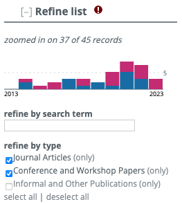

# 统计某作者所有文献并按格式要求导出

## 任务需求和分析

需求：

1. 统计几位老师发表过的所有论文（期刊 + 会议）。
2. 以 Word 文档方式记录条目，按时间顺序排列。
3. 条目格式有要求，如：`[1] Xin Deng, Enpeng Liu, Shengxi Li, Yiping Duan, and Mai Xu, "Interpretable multi-modal image registration network based on disentangled convolutional sparse coding," IEEE Transactions on Image Processing, vol. 32, pp. 1078-1091, 2023.`，其中期刊名称斜体。

分析：

1. 绝不用人工方式完成任务：否则需求一改，一切都要推倒重来。
2. 任务有一定自由度：文献列表只需要尽可能完整，并没有要求基于某个特定数据库检索。

本文方案最终效果：


## 方案总体设计

1. 用 dblp 数据库导出每一位老师的文献记录（BibTeX 格式）。dblp 有几大优点：
   - 文献统计较为完整，遗漏文献较少。
   - 格式规整，方便后处理。例如，每一个条目有规范的 ID，方便后续在所有老师的文献列表中去重。
2. 将 BibTeX 格式转换为 Python 易处理的 JSON 格式。千万不要在文本格式上继续处理，否则光是文本解析的代码编写就要花很大精力。
3. 按要求的格式生成每一个条目，写入 Word。
4. 检查导出 Word，优化数据处理细节。

以下为具体方案。

## 步骤一：导出 dblp 数据（BibTeX 格式）

以两位老师为例。一个一个来。

1. 在 dblp 中找到所有老师的档案（注意有重名的，不要选错）。
2. 如下图所示，取消勾选 `Informal`，只保留期刊和会议。
3. 此时会出现如图的红色感叹号，如下图所示。光标移动到感叹号处，选择 BibTeX 格式导出。
4. 右键 `download as .bib file`，选择「下载链接文件为」，将下载文件命名为 `<name>.bib`。



假设我们得到了「name1.bib」和「name2.bib」两个文件。

## 步骤二：转 BibTeX 为 JSON

BibTeX 属于文本格式，不利于我们的数据处理。因此我们必须要先把数据转换为 JSON 等易处理格式。

用 pip 或 Conda 安装 Pandoc，然后执行：

```bash
pandoc name1.bib -s -f biblatex -t csljson > name1.json
pandoc name2.bib -s -f biblatex -t csljson > name2.json
```

以下为效果展示。转换前：

```bibtex
@article{DBLP:journals/pami/GuanJ0XJZL23,
  author    = {Zhenyu Guan and
               Junpeng Jing and
               Xin Deng and
               Mai Xu and
               Lai Jiang and
               Zhou Zhang and
               Yipeng Li},
  title     = {DeepMIH: Deep Invertible Network for Multiple Image Hiding},
  journal   = {{IEEE} Trans. Pattern Anal. Mach. Intell.},
  volume    = {45},
  number    = {1},
  pages     = {372--390},
  year      = {2023},
  url       = {https://doi.org/10.1109/TPAMI.2022.3141725},
  doi       = {10.1109/TPAMI.2022.3141725},
  timestamp = {Mon, 09 Jan 2023 00:00:00 +0100},
  biburl    = {https://dblp.org/rec/journals/pami/GuanJ0XJZL23.bib},
  bibsource = {dblp computer science bibliography, https://dblp.org}
}
```

转换后：

```json
[
  {
    "DOI": "10.1109/TPAMI.2022.3141725",
    "URL": "https://doi.org/10.1109/TPAMI.2022.3141725",
    "author": [
      {
        "family": "Guan",
        "given": "Zhenyu"
      },
      {
        "family": "Jing",
        "given": "Junpeng"
      },
      {
        "family": "Deng",
        "given": "Xin"
      },
      {
        "family": "Xu",
        "given": "Mai"
      },
      {
        "family": "Jiang",
        "given": "Lai"
      },
      {
        "family": "Zhang",
        "given": "Zhou"
      },
      {
        "family": "Li",
        "given": "Yipeng"
      }
    ],
    "container-title": "IEEE Trans. Pattern Anal. Mach. Intell.",
    "id": "DBLP:journals/pami/GuanJ0XJZL23",
    "issue": "1",
    "issued": {
      "date-parts": [
        [
          2023
        ]
      ]
    },
    "page": "372-390",
    "title": "DeepMIH: Deep Invertible Network for Multiple Image Hiding",
    "title-short": "DeepMIH",
    "type": "article-journal",
    "volume": "45"
  },
]
```

额外的好处：原本 BibTeX 中的 `{IEEE}` 被转换为 JSON 中的 `IEEE`，即去掉了括号。

## 步骤三：数据处理

处理逻辑：

1. 依次读入两个 JSON 文件。将所有数据合并为一个列表。
2. 根据 id，跳过重复项。这是因为不同老师可能发表了同一篇论文。
3. 对于每一个条目，提取所需信息，根据要求生成格式化的条目，并用 `year-id` 作为 key 记录至一个字典中。`year` 为 JSON 中的 `issued:date-parts`。
4. 根据 `year-id` 排序字典的 keys，从而实现「根据时间排序条目」。
5. 根据排序好的 key，将字典 item 写入 Word。可以在每个条目前加上序号。

最终的 Python 程序在[这里](../demo/compile_publications/main.py)。

注意，由于要导入至 Word，因此程序用到了 python-docx 包；可以用 pip 或 Conda 安装。

程序细节：

- 将某些期刊名称缩写转为全称。dblp 大量使用了缩写，如上例中的 `IEEE Trans. Pattern Anal. Mach. Intell.`；而我们需要全称。我暂时没有办法解决这个问题，只好人工标注，即找出所有缩写（搜索 `.`），记录缩写和全称到子程序 `parse_journal` 中的字典里。
- 精炼某些会议名称。dblp 的会议名称太冗长。例如 `IEEE/CVF Conference on Computer Vision and Pattern Recognition Workshops, CVPR Workshops 2022, New Orleans, LA, USA, June 19-20, 2022`，我们只需要逗号前的字符串，即 `IEEE/CVF Conference on Computer Vision and Pattern Recognition Workshops`。注意，有些会议名称中有逗号，例如 `IEEE international conference on acoustics, speech and signal processing`。我将缩写和全称记录到子程序 `parse_conference` 中的字典里。
- 自适应缺项。有的条目可能缺少 `volume`、`number` 或 `page`；程序自动检测 JSON 条目中是否存在这些信息，如果有依次加入条目，如果没有也不会报错。
- 期刊和会议名称要求以斜体记录在 Word 中。

如果要进一步优化结果，还有几点可以做：

- 增加条目：dblp 不全；可以结合谷歌学术等检索库进一步增加条目。dblp 收录的主要是计算机领域的论文。
- 删减条目：有的条目可能是 dblp 中其他重名作者的条目，需要人工筛查和删除。
- 优化条目：论文标题、期刊会议名称的大小写方法不统一。

如果有更好的数据库、处理逻辑或方法，欢迎交流。
