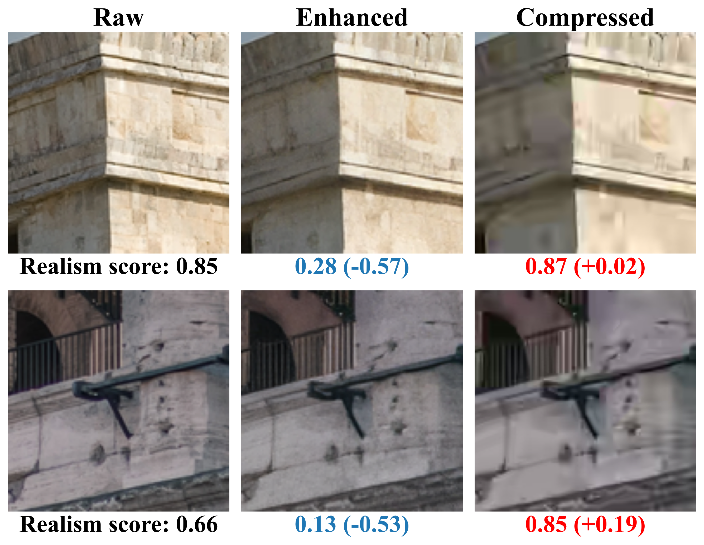
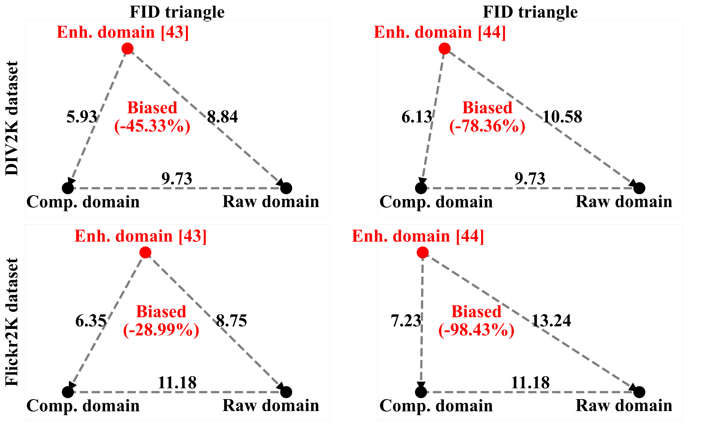
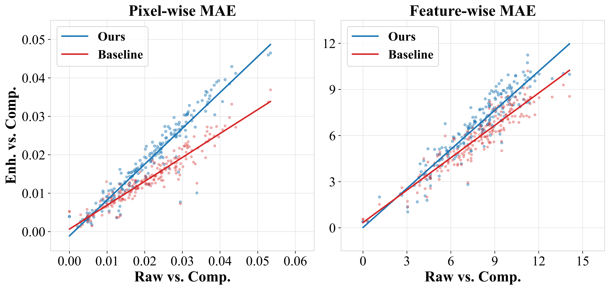
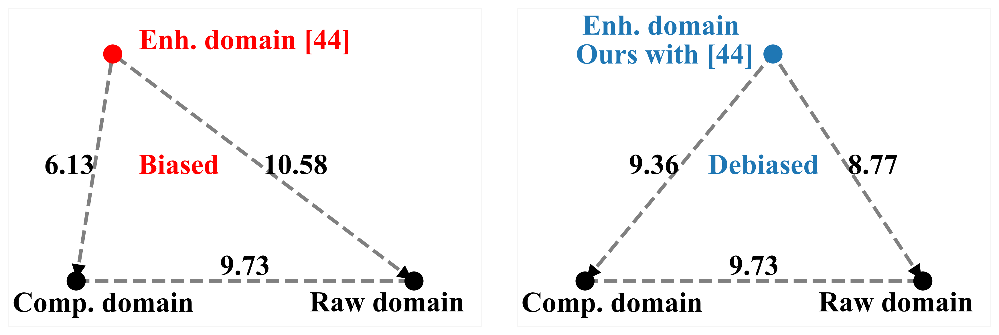
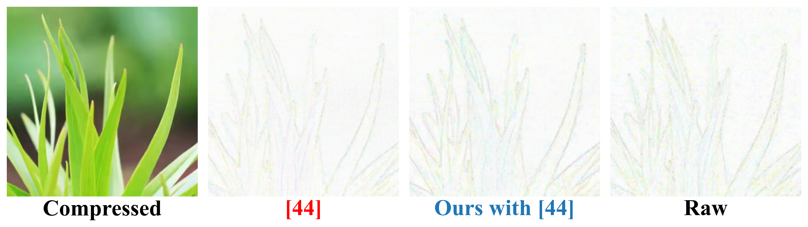

# 论文速览：压缩图像感知质量增强的压缩偏置现象（CVPR'24）

论文标题：*Enhancing Quality of Compressed Images by Mitigating Enhancement Bias Towards Compression Domain*

论文链接：https://arxiv.org/abs/2402.17200

本文针对基于 GANs 的压缩图像感知质量增强方法，观察到了一种压缩偏置现象。具体表现在两个方面：

1. 鉴别器倾向于认为压缩图像比原始图像更逼真；
2. 相比与原始图像的相似度，增强图像与压缩图像的相似度更高。

通过引入条件鉴别器和鼓励增强-压缩差异的损失函数，本文缓解了这一现象，从而改善了 FID 等生成指标。

## 压缩偏置现象

现有的压缩图像感知质量增强方法多基于一倍超分辨率方法。以 Real-ESRGAN 为例，其鉴别器虽能区分增强与原始图像，却将压缩图像视为为比原始图像更逼真的图像：

|    方法     | 数据集 | 原始图像得分 | 增强图像得分 | 与原始图像得分之差 | 压缩图像得分 | 与原始图像得分之差 |
| :---------: | :----: | :----------: | :----------: | :----------------: | :----------: | :----------------: |
| Real-ESRGAN | DIV2K  |     0.76     |     0.28     |       -0.48        |     0.84     |       +0.08        |

图表显示，压缩图像在鉴别器得分中排名最高，意味着它们被视为最逼真的图像。

> 这一现象也发生在了其他图像恢复任务中。如 DualFormer[^dualformer] 中所述，现有超分辨率方法的鉴别器也倾向于偏好低质量图像。该文章将这一现象归因于鉴别器的频域缺陷。

从生成器的视角看，这一现象或导致增强图像过度接近输入的压缩图像、而非原始图像，可能引起类似模式坍塌的问题，使得增强图像多样性降低、与输入的压缩图像过度耦合：

上图显示，增强图像与压缩图像的残差更小。

进一步，作者通过三角图表测量并描绘了压缩图像、原始图像和增强图像集之间的 FID 差异[^triangle]，并量化了顶点相对于底边中心的偏移量：

如图所示，增强图像集与压缩图像集的相似度较高，反映出增强仍有提升空间。

## 缓解压缩偏置

基于上述发现，作者反思了增强训练过程中，尤其是在 GANs 的对抗训练框架下，压缩图像作为压缩失真的载体并未受到足够重视。可能有两个原因：

1. 如前所述，现有的压缩图像感知质量增强方法主要基于一倍超分辨率方法。在超分辨率任务中，由于输入图像和标签图像、输出图像的分辨率不同，因此输入图像不易被直接利用。
2. 标准的对抗学习中只关注生成分布与目标分布的拟合情况，并不考虑第三种分布。

我们观察到，增强任务、乃至大多数图像恢复任务中，存在以下关系：

如果将三种图像视为随机变量，上述关系表明，在压缩图像这一条件下，原始图像和增强图像是独立的：

$$
p(\text{原始}, \text{增强} | \text{压缩}) = p(\text{原始} | \text{压缩}) \cdot p(\text{增强} | \text{原始}, \text{压缩}) = p(\text{原始} | \text{压缩}) \cdot p(\text{增强} | \text{压缩})
$$

> 前者是因为链式法则，后者是因为因果关系。

因此，将压缩图像引入 GANs 鉴别器将允许鉴别器分辨两个条件独立的变量，而非两个相关变量。这种改变有可能改善模式坍塌问题。

通过简单拼接这三种分辨率相同的图像输入鉴别器，实验证明此方法能够显著改进 Real-ESRGAN 的鉴别器性能：

|    方法     | 数据集 | 原始图像得分 | 增强图像得分 | 与原始图像的差异 | 压缩图像得分 | 与原始图像的差异 |
| :---------: | :----: | :----------: | :----------: | :--------------: | :----------: | :--------------: |
| Real-ESRGAN | DIV2K  |     0.87     |     0.04     |      -0.83       |     0.05     |      -0.82       |

> 一些图像感知压缩的工作，如 HiFiC[^hific]，观察到了条件鉴别器对于改善生成 FID 的重要作用，但没有进一步探究原因。

此外，作者还试图在训练中引入关于原始-压缩差异的先验知识。当增强-压缩差异小于原始-压缩差异时，网络被损失函数引导以扩大差异。

引入损失函数后，如图所示，增强-压缩差异趋近于原始-压缩差异，而之前通常情况下，前者小于后者。

## 实验验证与局限性

实验结果证实，改善压缩偏置后，生成质量（以 FID 为例）有显著提高：

图中展示，改善后的 Real-ESRGAN 在 FID 指标上（8.77）优于增强前（9.73），FID 值越低代表生成质量越高。有意思的是，改善前的 Real-ESRGAN 在 FID 指标上仅达到 10.58，不如增强前水平。

图中显示的是压缩图像以及与压缩图像的残差图。可见，改善后的 Real-ESRGAN 生成了更多细节，与原始图像更为接近。

尽管如此，本文的局限性在于：

1. 输入和输出高度相似的情况是符合直觉的。但对于模式坍塌的假设，本文仅提供了一种可能的解释，但没有提供更深入的理论依据。
2. 本文对于生成质量的改善并没有进行深入研究，例如增强图像多样性的增加以及压缩伪影的抑制等问题。这些都需要后续工作进一步探讨。

[^dualformer]: On the Effectiveness of Spectral Discriminators for Perceptual Quality Improvement. ICCV 2023.

[^triangle]: 理论上需满足三角不等式。实践中均满足。

[^hific]: High-Fidelity Generative Image Compression. NeurIPS 2020.
