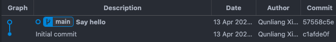
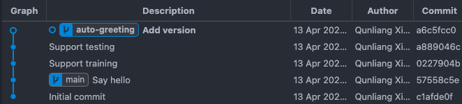
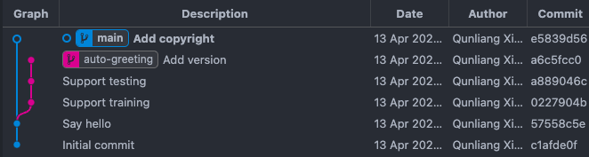
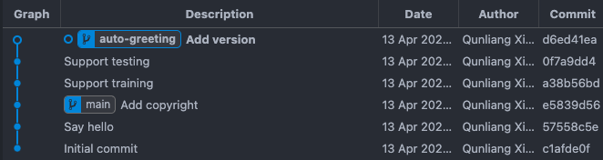
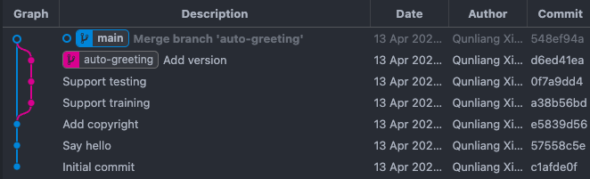

# Git 子分支开发并汇入主分支

代码总结如下：

```bash
# 创建子分支 auto-greeting 再开发
$ git checkout -b auto-greeting
# 开发

# 更新本地的主分支
$ git switch main
$ git pull

# 解决冲突
$ git switch auto-greeting
$ git rebase main
# 逐个解决有问题的提交
$ git rebase --continue  # 解决当前冲突后执行；可能会有多次
# $ git rebase --abort  # 也可以放弃 rebase

# 汇入主分支
$ git switch main
$ git merge --no-ff -m 'Support auto-greeting' auto-greeting  # 禁用 ff 模式
```

具体流程如下。

## 开发新功能

假设最原始的主分支（main 分支）如图：



图中的主分支是一根光秃秃的直线，只有 2 次提交，最新提交为 57558c5e。

为了开发新功能（例如自动打招呼），我们不要直接修改主分支，而是从主分支的最新节点切出一个子分支（可以命名为 auto-greeting 分支），在子分支上开发：

```bash
$ git checkout -b auto-greeting
```

子分支可以随意造，大不了毁灭删掉。我通常是直线开发，且通常会有多个提交：



如图，我们从主分支最新提交 57558c5e 切出子分支，然后在子分支产生了 3 次提交。

开发完毕，我们希望将新功能汇入主分支。

## 解决子分支和主分支的冲突

正常情况下，子分支和主分支不会有冲突，因为子分支是从主分支的最新提交切出来的，并且主分支没有变化。

问题是，其他团队或者自己在其他笔记本上可能向远端的主分支提交了新代码，因此 57558c5e 可能已经不是主分支最新的提交。

为了确定这一点，我们要更新本地的主分支。

```bash
$ git switch main
$ git pull
```

果然，主分支出现了比 57558c5e 更新的提交（e5839d56）：



理想情况下，我们应当从主分支的最新提交（即 e5839d56）切出子分支。我们使用 [git rebase](https://git-scm.com/docs/git-rebase) 功能。

> Rebase 是将子分支 auto-greeting 所有的提交缓存，然后从主分支的最新提交 e5839d56 重新切出子分支 auto-greeting，再应用缓存的提交。

```bash
$ git switch auto-greeting
$ git rebase main
Auto-merging README.md
CONFLICT (content): Merge conflict in README.md
error: could not apply a6c5fcc... Add version
hint: Resolve all conflicts manually, mark them as resolved with
hint: "git add/rm <conflicted_files>", then run "git rebase --continue".
hint: You can instead skip this commit: run "git rebase --skip".
hint: To abort and get back to the state before "git rebase", run "git rebase --abort".
Could not apply a6c5fcc... Add version
```

不幸的是，在上例中，主分支最新提交和子分支修改了同一个文件（如 README.md）；因此我们需要手动解决冲突。

> 所谓解决冲突，是指 git 无法确认 README.md 应当处于何种状态；因为主分支和子分支都对该文件有修改，且二者修改不是顺序发生的（如果是顺序发生的，就以最后一次修改后的状态为准）。因此，我们需要人工介入，查看并编辑 README.md，确认其为最终所需状态后，提交本次修改。

直接打开 README.md，确认文件的最终形态，保存并退出文件，然后执行：

```bash
$ git add README.md
$ git rebase --continue
```

Git 会依次检查所有子分支的提交，暂停在有问题的提交，等待我们手动解决问题，然后继续，直至解决所有冲突。在上例中，有问题的是最后一次提交 a6c5fcc0，因此本次修改是对 a6c5fcc0 的修改。

冲突解决后，子分支改为从主分支最新提交（e5839d56）切出，然后重新执行了原 3 次提交，其中最后一次是修改后的提交。



> 前面提到，rebase 是将子分支 auto-greeting 所有的提交缓存，然后从主分支的最新提交 e5839d56 重新切出子分支 auto-greeting，再应用缓存的提交。因此，这 3 次提交是「重新应用」的新提交，故 ID 都是新的。

## 汇入主分支

最后，我们将子分支汇入主分支。由于之前完成了 rebase，说明子分支和主分支不存在冲突了。因此 merge 会很顺利。

```bash
$ git switch main
$ git merge --no-ff -m 'Support auto-greeting' auto-greeting
```

> 这里禁用了 [fast-forward](https://git-scm.com/book/en/v2/Git-Branching-Basic-Branching-and-Merging) 模式。如果使用 ff 模式，merge 不会产生下图中的交汇节点，而是简单地让主分支指向子分支的最新提交 d6ed41ea，相当于让子分支所有提交在主分支上重新应用一遍。ff 模式下，主分支产生多个提交；禁用 ff 模式下，在主分支有且仅有一次新的提交。



如图，merge 会产生一次提交，从而产生子分支和主分支的一个交汇节点。Merge 相当于把子分支所有提交汇总成了一个提交，然后应用在主分支的最新提交上。

> 图中的 git graph 是我理想中的形态。（1）主分支和子分支分别都是直线形，简洁明了；（2）子分支以 merge 的形式汇入主分支，保留开发印记；（3）借助 rebase，子分支从主分支的最新提交切出，保证只要子分支通过测试，主分支肯定也能通过测试。
