# 计算机视觉论文的插图

| 主题       | 图                                | 评价                                                                                                                                         | 出处                                                                                  |
| ---------- | --------------------------------- | -------------------------------------------------------------------------------------------------------------------------------------------- | ------------------------------------------------------------------------------------- |
| Novelty    | 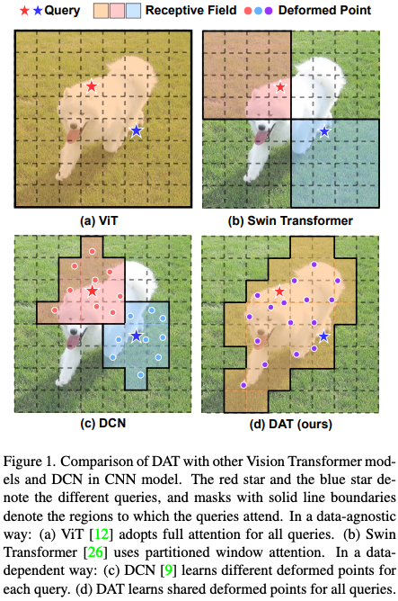 | 通过一个好例子，把工作的核心创新点说清楚了                                                                                                   | Vision Transformer with Deformable Attention                                          |
| Pipeline   | 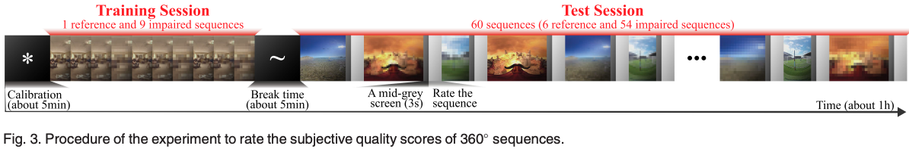 | 把视频帧展开                                                                                                                                 | Viewport-Based CNN: A Multi-Task Approach for Assessing 360° Video Quality            |
| Pipeline   | 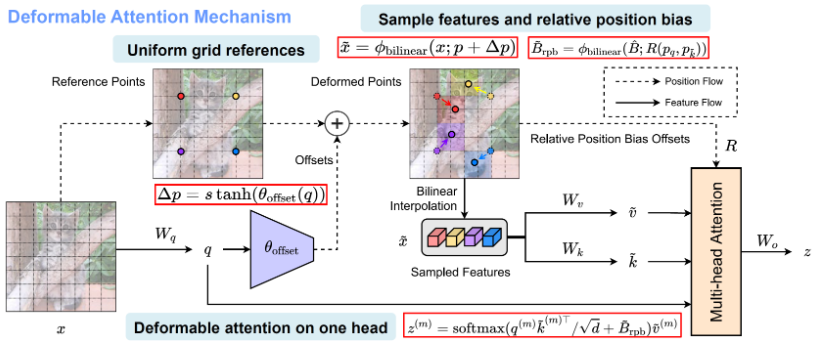 | 简单；图文并茂                                                                                                                               | Vision Transformer with Deformable Attention                                          |
| Pipeline   | 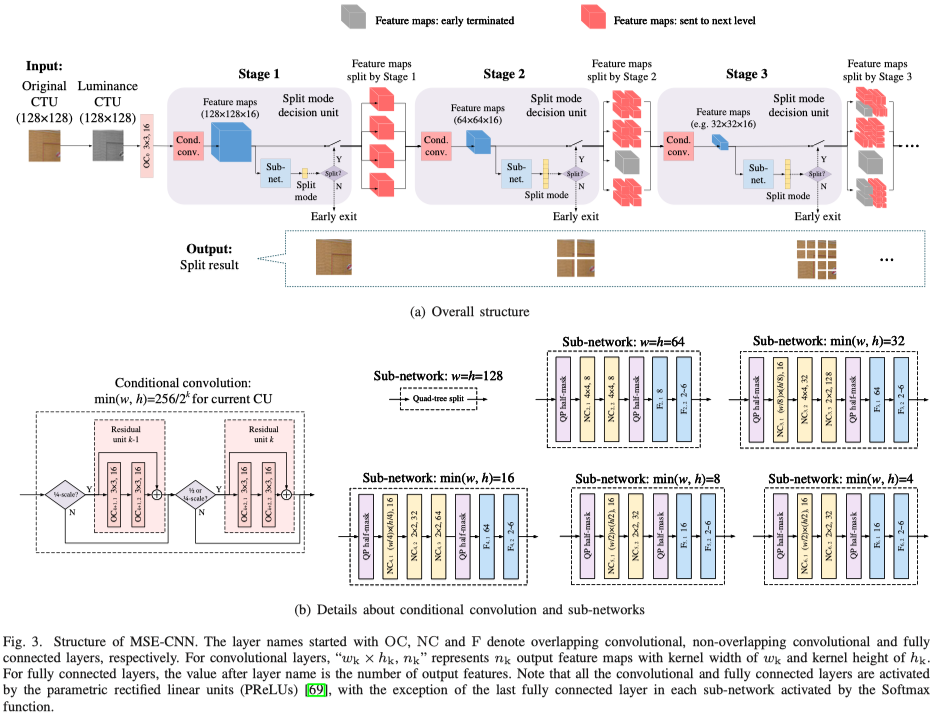 | 简单、清楚地说明了方法原理。看多了复杂的网络结构图，感觉还是这种直来直去的简洁风格最让人喜欢。要做到“简单”一点也不简单，需要抽象出方法的本质 | DeepQTMT: A Deep Learning Approach for Fast QTMT-based CU Partition of Intra-mode VVC |
| Pipeline   | 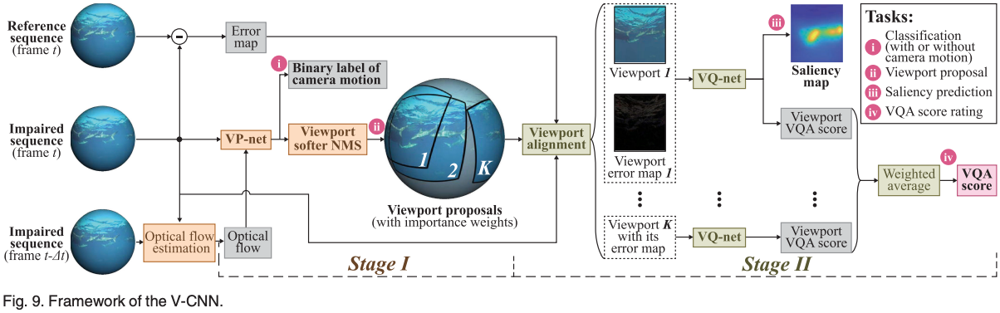 | 基本的Framework和展开                                                                                                                        | Viewport-Based CNN: A Multi-Task Approach for Assessing 360° Video Quality            |
| Pipeline   | 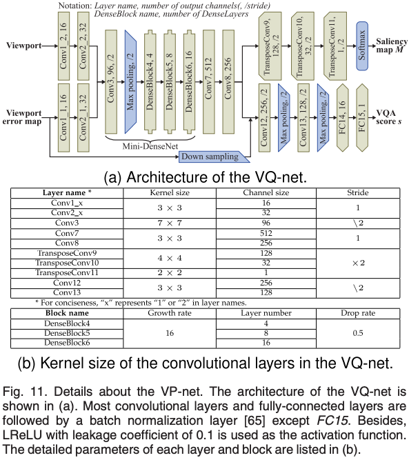 |                                                                                                                                              | Reducing Complexity of HEVC: A Deep Learning Approach                                 |
| Pipeline   | 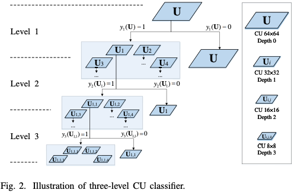 |                                                                                                                                              | Reducing Complexity of HEVC: A Deep Learning Approach                                 |
| Pipeline   | 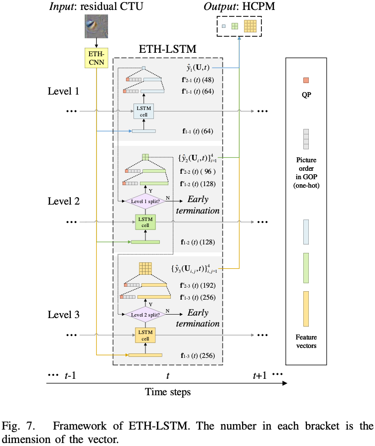 |                                                                                                                                              | Reducing Complexity of HEVC: A Deep Learning Approach                                 |
| Pipeline   | 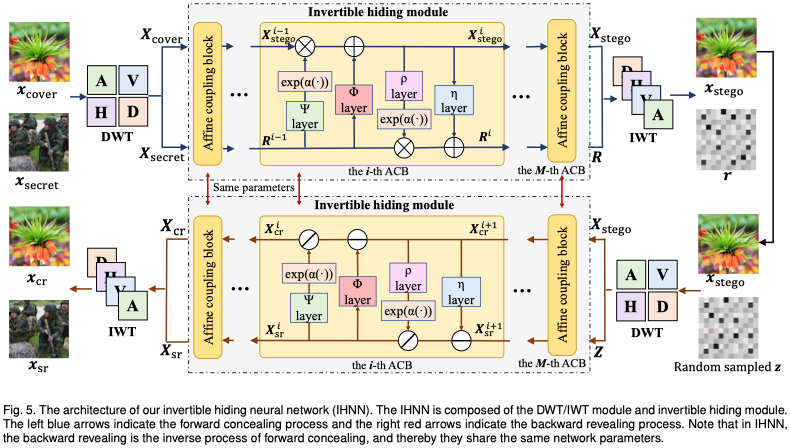 | 把重复模块的其中一个展开；不用暴露网络结构，图文结合                                                                                         | DeepMIH: Deep Invertible Network for Multiple Image Hiding                            |
| Pipeline   | 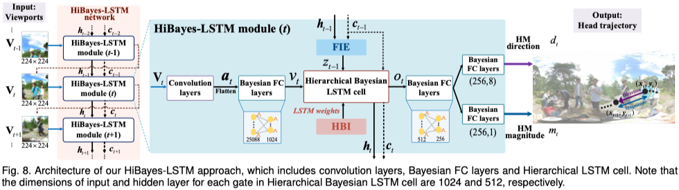 | 一种展开方式                                                                                                                                 | Hierarchical Bayesian LSTM for Head Trajectory Prediction on Omnidirectional Images   |
| Pipeline   | 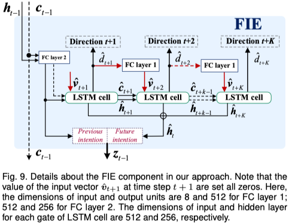 | 变量、网络结构、连接、配色                                                                                                                   | Hierarchical Bayesian LSTM for Head Trajectory Prediction on Omnidirectional Images   |
| Pipeline   | 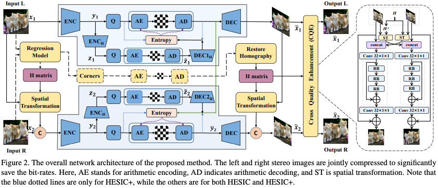 | 可以堆叠简单模块，因为画图目的是讲清楚细节；要满足对称等美学原则                                                                             | Deep Homography for Efficient Stereo Image Compression                                |
| Pipeline   | 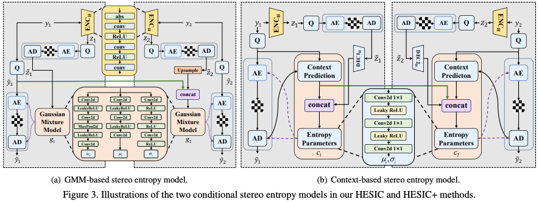 | 可以堆叠简单模块，因为画图目的是讲清楚细节；要满足对称等美学原则                                                                             | Deep Homography for Efficient Stereo Image Compression                                |
| Pipeline   | 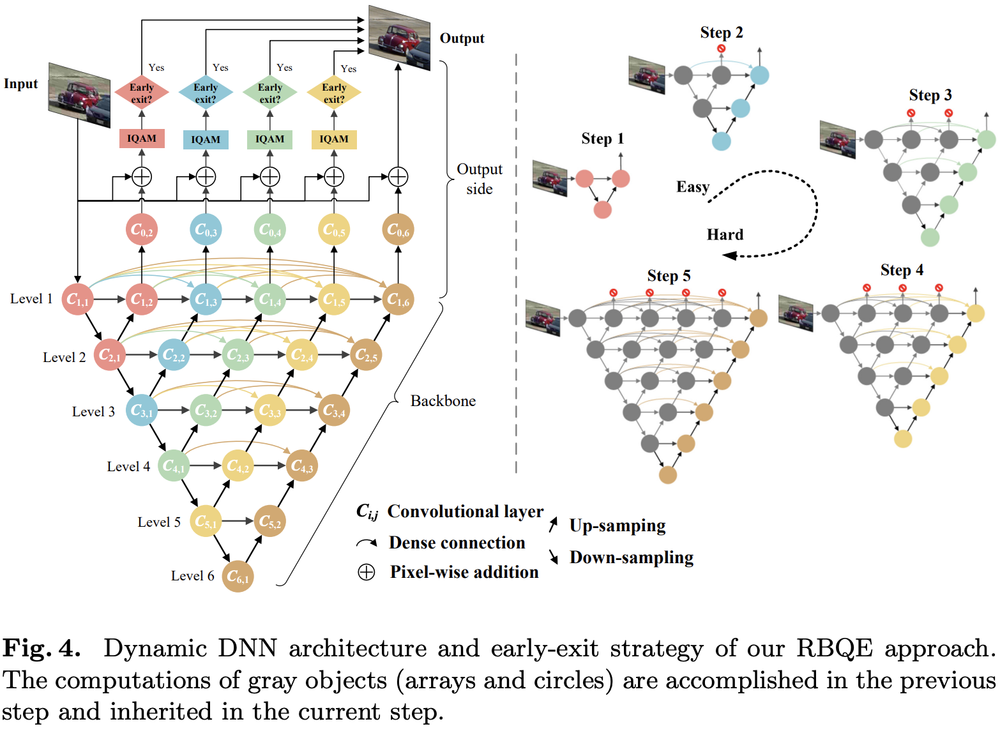 | 抽象化节点，突出拓扑优势                                                                                                                     | Early Exit or Not: Resource-Efficient Blind Quality Enhancement for Compressed Images |
| Pipeline   | 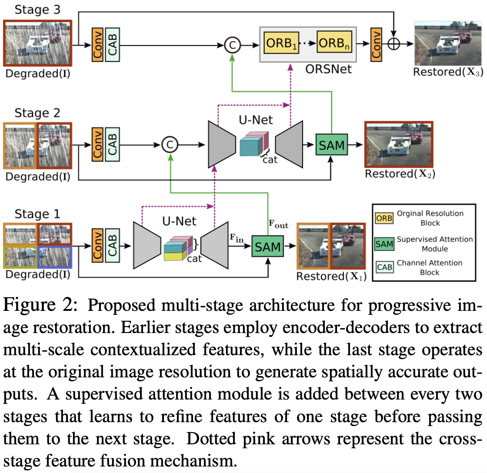 | 示意化注意力；实际未必如此                                                                                                                   | Multi-Stage Progressive Image Restoration                                             |
| Pipeline   | 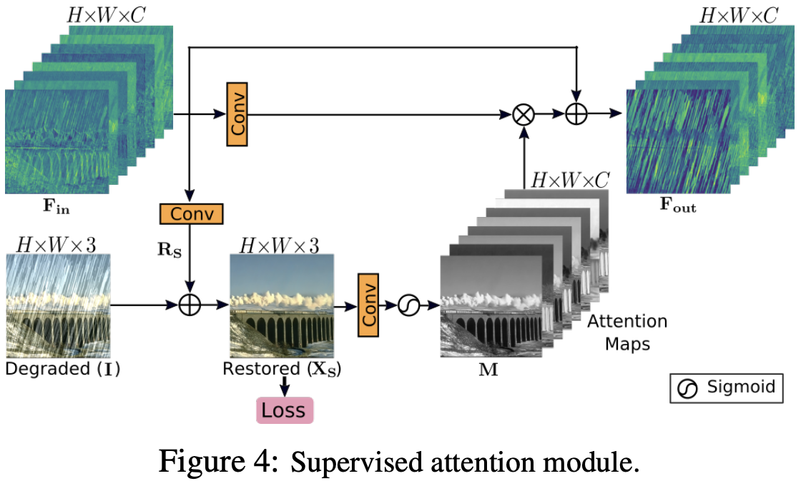 | 示意化注意力；实际未必如此                                                                                                                   | Multi-Stage Progressive Image Restoration                                             |
| Pipeline   | 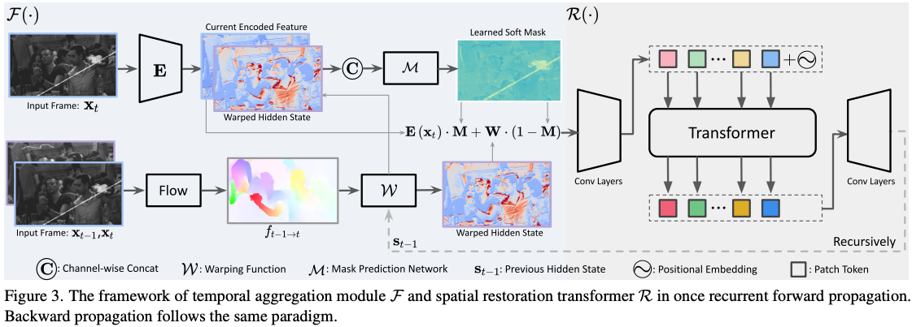 | 中间结果很好看                                                                                                                               | Bringing Old Films Back to Life                                                       |
| Statistics | 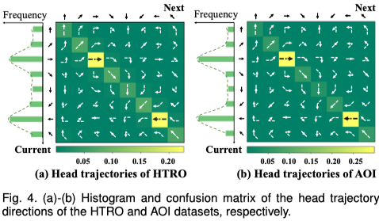 | 结合示意和数据；柱形图上还有折线，让构图稍微复杂些                                                                                           | Hierarchical Bayesian LSTM for Head Trajectory Prediction on Omnidirectional Images   |
| Statistics | 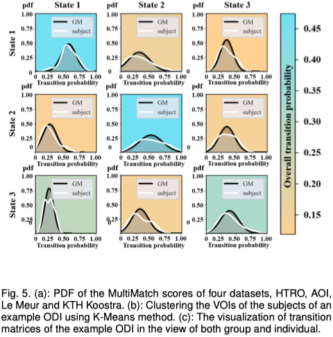 | 很可爱的画风，但很难驾驭，很难和其他图统一风格。慎用                                                                                         | Hierarchical Bayesian LSTM for Head Trajectory Prediction on Omnidirectional Images   |
| Statistics | 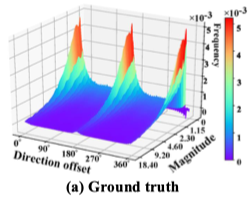 |                                                                                                                                              | Hierarchical Bayesian LSTM for Head Trajectory Prediction on Omnidirectional Images   |
| Statistics | 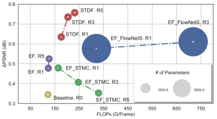 |                                                                                                                                              | Spatio-Temporal Deformable Convolution for Compressed Video Quality Enhancement       |
| Statistics | 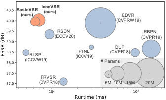 |                                                                                                                                              | BasicVSR: The Search for Essential Components in Video Super-Resolution and Beyond    |
| Demo       | 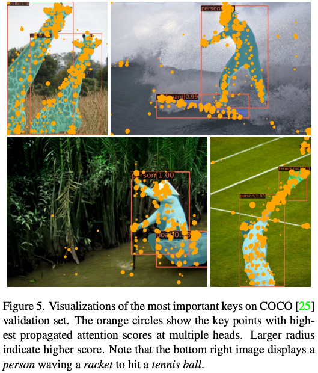 | 把识别目标都调成了翠绿色，衬托橙色锚点                                                                                                       | Vision Transformer with Deformable Attention                                          |
| Demo       | 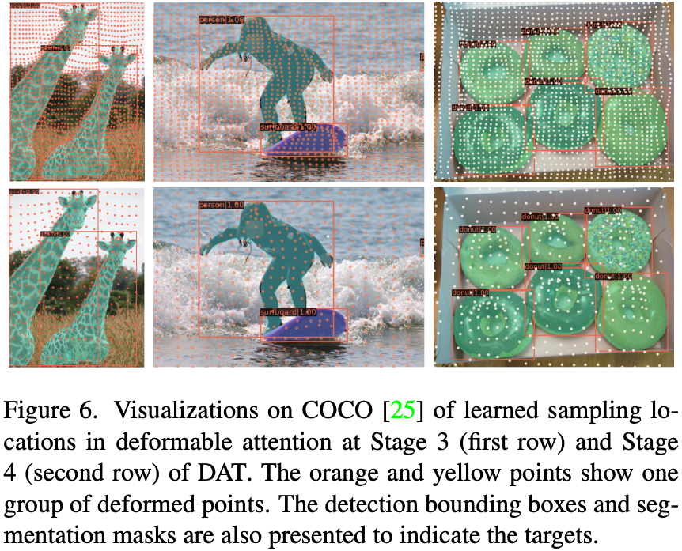 | 把识别目标都调成了翠绿色，衬托橙色锚点                                                                                                       | Vision Transformer with Deformable Attention                                          |
| Demo       | 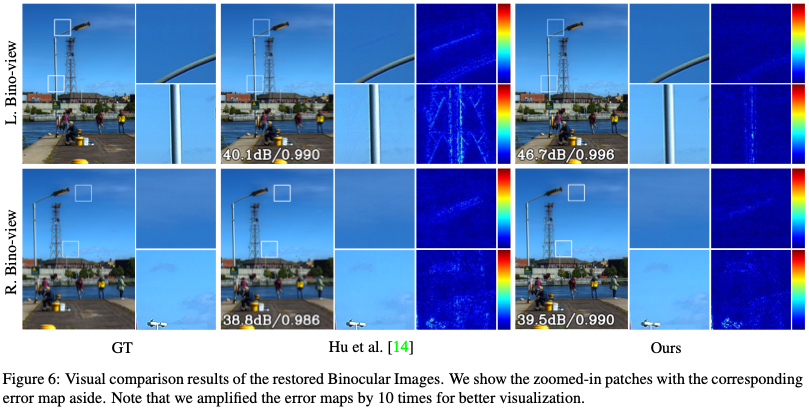 | 主观图不明显，那就加上残差                                                                                                                   | https://arxiv.org/pdf/2109.04242.pdf                                                  |
| Demo       | 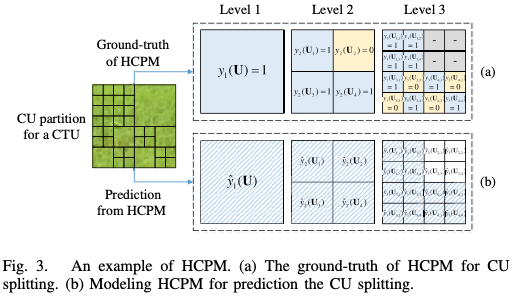 | 图文并茂                                                                                                                                     | Reducing Complexity of HEVC: A Deep Learning Approach                                 |
