# PAPER DAILY

- [PAPER DAILY](#paper-daily)
  - [Learning Enriched Features for Real Image Restoration and Enhancement](#learning-enriched-features-for-real-image-restoration-and-enhancement)
  - [BBN: Bilateral-Branch Network with Cumulative Learning for Long-Tailed Visual Recognition](#bbn-bilateral-branch-network-with-cumulative-learning-for-long-tailed-visual-recognition)
  - [SRFlow: Learning the Super-Resolution Space with Normalizing Flow](#srflow-learning-the-super-resolution-space-with-normalizing-flow)
  - [Multi-level Wavelet-based Generative Adversarial Network for Perceptual Quality Enhancement of Compressed Video](#multi-level-wavelet-based-generative-adversarial-network-for-perceptual-quality-enhancement-of-compressed-video)
  - [Photo-Realistic Single Image Super-Resolution Using a Generative Adversarial Network](#photo-realistic-single-image-super-resolution-using-a-generative-adversarial-network)
  - [ESRGAN: Enhanced Super-Resolution Generative Adversarial Networks](#esrgan-enhanced-super-resolution-generative-adversarial-networks)
  - [Pixel-Adaptive Convolutional Neural Networks](#pixel-adaptive-convolutional-neural-networks)
  - [Drop an Octave: Reducing Spatial Redundancy in Convolutional Neural Networks with Octave Convolution](#drop-an-octave-reducing-spatial-redundancy-in-convolutional-neural-networks-with-octave-convolution)
  - [Enhanced Image Decoding via Edge-Preserving Generative Adversarial Networks](#enhanced-image-decoding-via-edge-preserving-generative-adversarial-networks)
  - [Making a ‘Completely Blind’ Image Quality Analyzer](#making-a-completely-blind-image-quality-analyzer)
  - [Learning a No-Reference Quality Metric for Single-Image Super-Resolution](#learning-a-no-reference-quality-metric-for-single-image-super-resolution)
  - [The Unreasonable Effectiveness of Deep Features as a Perceptual Metric](#the-unreasonable-effectiveness-of-deep-features-as-a-perceptual-metric)
  - [The 2018 PIRM Challenge on Perceptual Image Super-Resolution](#the-2018-pirm-challenge-on-perceptual-image-super-resolution)
  - [The Contextual Loss for Image Transformation with Non-Aligned Data](#the-contextual-loss-for-image-transformation-with-non-aligned-data)
  - [HiFaceGAN: Face Renovation via Collaborative Suppression and Replenishment](#hifacegan-face-renovation-via-collaborative-suppression-and-replenishment)
  - [Video Multi-method Assessment Fusion](#video-multi-method-assessment-fusion)
  - [Image-To-Image Translation With Conditional Adversarial Networks](#image-to-image-translation-with-conditional-adversarial-networks)
  - [High-Resolution Image Synthesis and Semantic Manipulation With Conditional GANs](#high-resolution-image-synthesis-and-semantic-manipulation-with-conditional-gans)
  - [Semantic Image Synthesis with Spatially-Adaptive Normalization](#semantic-image-synthesis-with-spatially-adaptive-normalization)
  - [TO-LEARN](#to-learn)

## Learning Enriched Features for Real Image Restoration and Enhancement

MIRNet，ECCV 2020：注意力、多尺度的集大成网络。开源完善。声称是图像恢复的SOTA。

- [tag] 图像增强
- [tag] 注意力
- [tag] 3 stars

> 20-10-15

前人工作大多处理全分辨图像，或处理渐进的低分辨率表示。作者认为前者空域建模准确但语义建模不健壮，后者反之。本文希望在网络中保持高分辨率表示，同时从低分辨率表示中获取较好的语义信息。

大致集成了以下模块：多尺度卷积及其信息交互，空域和通道域注意力建模，基于注意力的多尺度特征融合。

经过如此繁杂的处理，作者认为提取的特征是enriched的。在多个image benchmark上达到了SOTA。

网络整体如图1所示，是一个块堆叠结构。每个块内部有两个多尺度残差块，多尺度残差块内部类似RANet结构，即降分辨率得到低分辨率表示，然后与高分辨率表示之间有交互。

交互具有选择性，如图2所示，本质就是基于注意力融合。

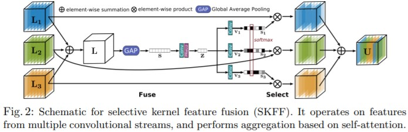

空域和通道域注意力见图3。一般操作。

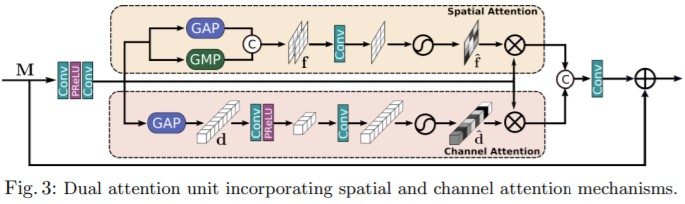

总的来说就是集大成，设计没啥特别的，但效果好（我怀疑速度很慢）。

## BBN: Bilateral-Branch Network with Cumulative Learning for Long-Tailed Visual Recognition

BBN，CVPR 2020：分开训练特征提取和分类器。长尾分类当年SOTA。

- [tag] 图像分类
- [tag] 长尾分布
- [tag] 4 stars

> 20-10-17

首先作者揭示，广泛用于长尾分布的重采样技术，虽然会增强分类器的学习，但在一定程度上会损害特征学习。

之后是一个有趣的实验。作者先用三种方式训练网络，然后冻结主干网络（所谓的特征提取部分），从零重训分类器，得到如图2结果。本文的motivation就出来了。

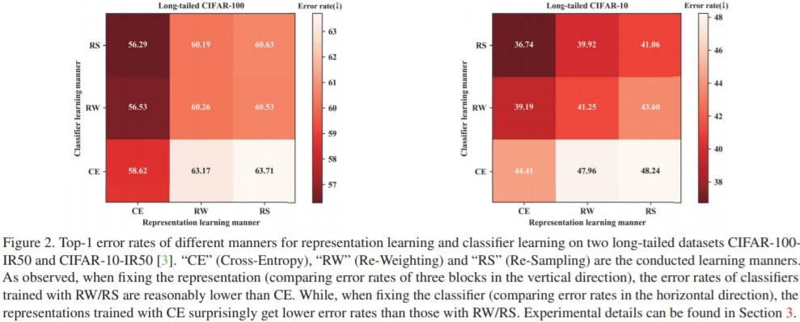

本文就希望同时兼顾二者的训练。

如图3，作者搭建了一个双路网络，称为BBN。在上路，数据是均匀采样的；在下路，数据是重均衡采样的。双路输出的特征通过加权组合，等价于双路的loss加权组合得到最终的loss。作者也将这种策略归为课程学习。

权重$\alpha$是变化的：在初始阶段更重视上路，在后期更重视下路。

具体而言，$\alpha = 1 - \left(\frac{T}{T_{max}}\right)^2$，$T$是epoch数。随着epoch增加，$\alpha$会加速减小。即给初始阶段提供了足够的时间。补充材料图7也说明了这一点，但貌似没有实验。

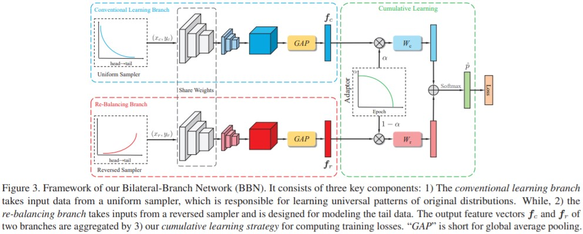

注意特征提取模块的参数是共享的。

## SRFlow: Learning the Super-Resolution Space with Normalizing Flow

SRFlow，ECCV 2020：基于Flow的生成方法。训练稳定，单一损失，变换结果简单，可逆。

- [tag] 图像超分辨
- [tag] Flow
- [tag] 4 stars

> 20-10-17

SR问题是一个经典的病态问题，有很多可能的解。这一事实很重要，但被现有方法忽略了：现有方法是限定的（deterministic），基于重建loss和对抗loss的组合学习。

本文提出用归一化的flow完成SR，损失函数仅使用负对数似然。该方案更贴近病态问题的本质，也能够生成多样的输出。

最关键的还是灵活改变输出。

作者称，SRFlow的PSNR和perceptual quality metrics都超过了GAN方法，太强了。

具体而言，本文设计了一个conditional normalizing flow结构。所谓conditional，就是提供LR条件下，预测潜在的HR的条件分布。

从第三章开始的方法没有细看了。

## Multi-level Wavelet-based Generative Adversarial Network for Perceptual Quality Enhancement of Compressed Video

MW-GAN，ECCV 2020：在小波域增强主观质量。

- [tag] 压缩视频增强
- [tag] GANs
- [tag] 小波域
- [tag] 2 stars

> 20-10-17

Motivation（图2）：主观质量与高频分量高度相关。现有增强方法大多都无法提升甚至恶化主观质量。说明方法：观察小波变换后的高频分量的能量大小。

网络设计（图3）：典型的GAN设计，只不过处理对象和训练标签都是图像的小波谱。

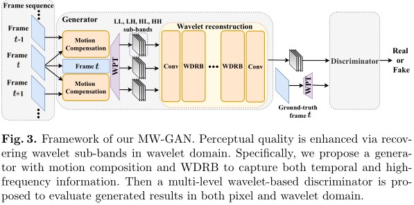

loss由小波域重建loss、运动补偿loss和对抗loss组成。对抗loss是随着epoch增大逐渐参与进来的，运动补偿loss是逐渐退出的，小波域重建loss在不同子带上有不同权重。

小提示（和作者交流）：
- 虽然故事说主观与高频很相关，但权重是一样的，并非重点收敛高频子带或放弃低频子带。
- 在小波域和像素域监督其实没啥区别。在小波域监督也会导致模糊。
- 用RGB训练比在Y上训练效果更明显。
- Multi-level对抗监督的做法被广泛使用，效果不错。
- 对压缩图像而言，保真也是很重要的，因此不能像SR那样随意。

后记：
- 主观效果不明显，原因是去掉了perceptual loss。
- 考虑了LPIPS和PI指标。

## Photo-Realistic Single Image Super-Resolution Using a Generative Adversarial Network

SRGAN，CVPR 2017：第一个实现4倍升采样的细节恢复网络。

- [tag] 图像超分辨
- [tag] GANs
- [tag] 5 stars

> 20-10-18

训练loss由content loss和对抗loss组成。对抗loss会迫使结果更接近自然图像。content loss要求perceptual相似性（VGG中后端特征的相似性），而非像素level的相似性。

结果显示，SRGAN的MOS得分要显著高于传统CNN的结果。

由图2，PSNR和SSIM高的图像，其主观质量并非最高的。

数据集获取：将HR图像高斯模糊，然后降采样。

训练是交替优化鉴别器D和生成器G。鉴别器的优化目标是：

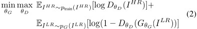

很简单，就是要准确认出真实图像，并且识别出假图像。

生成器是B个结构相同的块组成的。升采样通过sub-pixel（重排）实现。

根据[44]的建议，网络没有使用最大池化，并且使用了$\alpha=0.2$的LeakyReLU。鉴别器网络是8层3x3卷积层，每一层通道数从64到512增加，隔2层翻1倍。当通道数翻倍时，图像长和宽减小1/2（因为是分类器）。

生成器的loss采用组合形式：

其中第一项是VGG loss，即经过预训练的19层VGG网络的第j次卷积后（经ReLU激活）、第i次最大池化前输出的特征图的MSE：

$\phi$就是VGG参数。

第二项对抗loss，刻画生成图像与自然图像的差距，由监督器决定差距大小：

根据[22]，为了使梯度表现更好，该式没有使用$\log{(1 - D)}$。想象一下，如果D输出趋于0，那么loss应该越大越好，因此式6更好。

作者对比了content loss用MSE，VGG22和VGG54的结果，发现VGG54的MOS分表现最好。

## ESRGAN: Enhanced Super-Resolution Generative Adversarial Networks

ESRGAN，ECCVW 2018：改进SRGAN的细节问题。

- [tag] 图像超分辨
- [tag] GANs
- [tag] 4 stars

> 20-10-18

改进：
- 使用Residual-in-Residual Dense Block。
  - 取消了BN操作。
  - RRDB输出经过scaling后传输。
- 参数初始化方差尽可能小。实验证实的。
- 让鉴别器分辨两个图像哪个更真实，而不是判断是否真实。
- VGG loss改为对比激活前的特征。

最后，为了权衡PSNR和感知质量，作者尝试了网络参数插值和图像插值，结果是前者更好。

ESRGAN的整体结构和SRGAN保持一致（图3），但细节被修改。见图4。

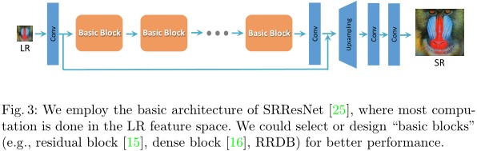

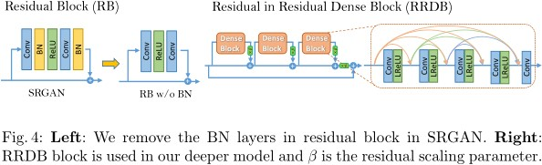

当训练数据和测试数据存在差距时，使用BN会导致伪影[26,32]。因此去除。所谓的Residual in Residual，就是大Residual嵌套小Residual。RRDB输出经过放缩后再并入主路，增强稳定性[35,26]。

鉴别器的loss和生成器的对抗loss分别改成了以下形式：

其中RaD是指Relativistic average Discriminator：

内部期望是在mini-batch上计算的。再具体：

最后，作者将VGG loss改为未激活的对比。这是因为特征图稀疏，激活后几乎都是inactive的。

生成器的loss改为三项，即最后加上一个L1重建loss，见式3。

$$
L_G = L_{percep} + \lambda L_G^{Ra} + \eta L_1
$$

为了让PSNR和感知质量权衡，或抑制GAN导致的噪声，我们可以调整L1 loss和对抗loss的权重。但这样做很麻烦。

在训练阶段，我们先用L1 loss训练生成器。然后再用式3的组合loss训练整个GAN。

## Pixel-Adaptive Convolutional Neural Networks

PAC，CVPR 2019：给卷积核乘以可学习的、spatially varying的权值。借鉴双边滤波器思想。

- [tag] CNNs
- [tag] 注意力
- [tag] 4 stars

> 20-10-19

看这篇论文前，可以回忆[双边滤波器](https://www.cnblogs.com/wangguchangqing/p/6416401.html)。不同于高斯滤波器（仅考虑位置关系），双边滤波器引入了$\alpha$截尾均值滤波器，考虑像素灰度值之间的差异；然后两个滤波器相乘，就得到了双边滤波器。

作者仿照双边滤波器，提出了PAC。与自注意力方法或全动态方法不同，PAC和双边滤波器一样，仅仅关注局部，因此在一定程度上减小了计算量，实现更简单。

接下来就是讲故事了。

参数共享是CNNs的优势，也是其劣势。为了解决该劣势，作者提出用spatially varying的权值乘以滤波器权值；该varying权值是根据局部像素信息学习得到的。

可以简单证明，PAC是许多滤波器的一般化，即可以特化为众多滤波器，例如双边滤波器、一般卷积和池化等。

直观上看，我们迫使CNNs卷积核共享是不合理的。为了减小loss，CNNs不得不用有限的卷积核来卷积不同内容的特征图。

再进一步，当CNNs训练好以后，卷积核参数就不可变了。本文方法引入了可学习的倍乘参数，因此对于不同的输入图像，可以产生不同的倍乘参数，改变卷积核权值。

现有的卷积核大致可以分为两种：一种是预定义的，例如双边滤波器；另一种是全动态的，很难扩展到整个网络，因为计算复杂度太大了。PAC在二者之间，往下看。

传统卷积是这样的：

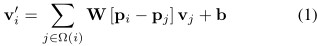

i是卷积中心点。可见，卷积核W取值仅仅取决于相对位置差$p_i - p_j$，与内容无关。

为了让卷积核W取值与内容有关，我们把位置进行编码，再对编码信息卷积，即：

但这样做（把特征映射到更高维空间），会导致卷积计算量庞大，卷积向量过于稀疏。

为了解决这一问题，作者采取了另一种方式：作者没有将特征往更高维空间映射后卷积，而是引入spatially varying的核K，让核对高维特征进行简单处理。

例如K可以取高斯核。此时，f就被称为adaptive feature，而K被称为adaptive kernel。f可以自定义，例如将位置信息和色彩信息编码：$f = (x, y, r, g, b)$，也可以是学出来的。

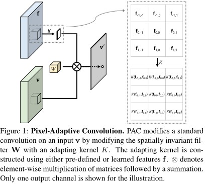

该方法可以特化为见过的卷积核。

- 当W为高斯滤波器时，双边滤波器就出现了。
- 当K恒等于1时，就是一般卷积；即不包含特殊的位置编码信息。
- 当K恒等于1，W恒等于1/(s^2)时，就是平均池化。

## Drop an Octave: Reducing Spatial Redundancy in Convolutional Neural Networks with Octave Convolution

OctConv，ICCV 2019：低频卷积的特征图（表示）是可压缩的，进而减小内存需求和计算量。

- [tag] CNNs
- [tag] 模型加速
- [tag] 频域
- [tag] 3 stars

> 20-10-21

在缩小低频通道尺寸的同时，设计了其与完整通道的交互方法。

设置一个超参数$0<\alpha<1$，使得$\alpha \%$通道的分辨率是减半的，剩余通道的分辨率不变。这样，计算量和内存需求都降低了。

如何得到这样的特征图呢？在OctConv的输入端，对于划分为低分辨率通道的通道输入，会被高斯模糊后采样，分辨率就变为1/2x1/2了。然后才是OctConv，交互方法也很直观，见图：

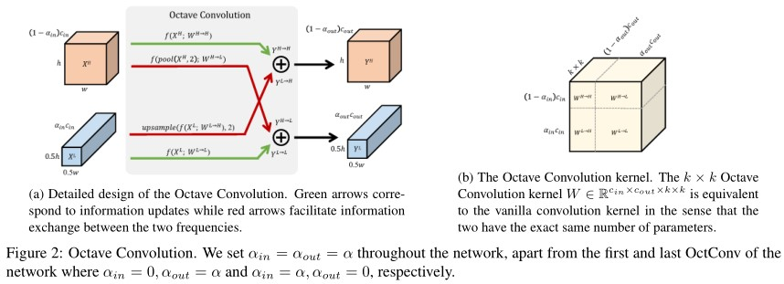

实验中对通道进行傅里叶变换，发现低频通道确实几乎只有低频，而完整通道高低频兼具。

作者称还能提高准确率。这一点或许和感受野扩大有关：缩小的通道上做卷积，相当于空洞卷积。

## Enhanced Image Decoding via Edge-Preserving Generative Adversarial Networks

EP-GAN，ICME 2018：用GAN增强解码视频质量。

- [tag] 压缩视频增强
- [tag] GANs
- [tag] 2 stars

> 20-10-30

在一般GAN的基础上加入一个图像边缘预测网络。用Sobel算子生成边缘map，在loss中惩罚生成边缘map与预测map的L2 loss。

预测map会和特征fuse，然后进一步处理。

仅考虑了JPEG；指标为PSNR-B，PSNR和SSIM。

## Making a ‘Completely Blind’ Image Quality Analyzer

NIQE，SPL 2012：通过衡量某些自然图像统计指标，给出图像的无参考质量评分。

- [tag] 无参考图像质量评估
- [tag] 5 stars

> 20-10-31

之前的NR IQA方法需要失真样本以及对应的人类主观评分。

而本文提出的Natural Image Quality Evaluator（NIQE）只需要自然图像，从中统计一些指标，从而摆脱了对训练数据的依赖。

即，NIQE不基于人类主观意见，也无需知道失真类型，而只考虑输入图像在一些自然指标上的表现情况。这种方法被称为NSS方法，即Natural Scene Statistic。

NIQE首先构建了一套quality aware的feature，然后将它们用multivariate Gaussian拟合。

上述feature可以通过一个NSS模型得到。那么，图像的质量就是两个MVG的距离：前者由自然图像的feature拟合得到，后者由输入图像的feature拟合得到。

首先要按照式1正则化。计算均值和方差都按高斯模板加权。由[10]，对于自然图像，高斯权重是合理的；但对失真图像，权重不一定满足高斯。因此自然图像和失真图像在正则化阶段就拉开了差距。

其次是选patch。作者认为人更关注纹理丰富区域，因此设置了一个方差阈值T。若方差大于T，则该patch被选择。

接下来是用零均值的generalized Gaussian distribution刻画像素x（相当于做一个变换）。该GGD有两个超参数$\alpha$和$\beta$，借助[14]的moment-matching方法可以预测。

对于自然图像，该刻画的空域连续性较强（[3]已证明）；但对有损图像，空域关联性就被破坏了。因此可以考虑水平、垂直方向的刻画的相关系数。

最后，分布的均值也有意义。

这样，4个方向，各4个参数，一共就有16个参数；加上自然图像和有损图像的分布均值，就是18个参数。最后，把图像高斯模糊后做因子为2的降采样，再得到18个参数，一共36个参数。

最后最后，我们用最大似然法，用一个MVG拟合这36个参数。

最终的NIQE，也即图像质量评分，就是两个MVG的距离，如式10。

## Learning a No-Reference Quality Metric for Single-Image Super-Resolution

Ma，CVIU 2016：早期无参考质量评估方法。

- [tag] 无参考质量评估
- [tag] 3 stars

> 20-10-31

简单来说，本文首先建立了MOS库，然后基于此训练网络。本文方法也是评估图像的统计特性，而不是衡量失真。

由于图片较多，因此作者采用绝对评分，而非相对评分（否则就更多了）。

具体而言，本文用3种指标来评估超分辨图像的质量：DCT、DWT和空域PCA，最后用随机森林回归。

实测慢的一批。分数从0到10，越高越好。

## The Unreasonable Effectiveness of Deep Features as a Perceptual Metric

LPIPS，CVPR 2018：深度网络普遍会生成类似的感知效果。感知loss可以在其他high-level任务上训练，效果都能远超low-level metrics。

- [tag] 有参考图像质量评估
- [tag] 3 stars

> 20-10-31

开篇就很有意思：深度网络及特征的比较判断更接近人类。

作者尝试了各种各样的网络，结果都类似。作者结论：深度网络存在普遍性的perceptual similarity。

这篇文章提了我想问的问题：VGG perceptual feature一定要从分类任务中得到吗？实验发现，并不是的！如自监督任务puzzle，也能胜任！甚至一个简单的自监督网络加上K means分类器，也能胜任，而且远比SSIM等好！但训练是必要的，随机初始化网络表现不好。

本文提出了一个BAPPS数据库，其只考虑pair内部谁更像，而非MOS分。

数据库中都是64x64的块。这是因为，当图片较大时，人们可能考虑图像的语义相似性，而非low-level视觉效果。

这种对比建库有一个问题：实验者可能会将同一套标准贯穿整个实验，从而较快完成实验，那么判断就有主观偏见了。因此作者还引入了JND实验，让实验者回答两张图片是否不同。相似的图像最容易混淆。显然，好的指标应该从最容易混淆到最不容易混淆的样本中都采样。结果发现40%回答都是找不出区别。

最后，网络用的是最轻量级的SqueezeNet。3个方案：lin，固定W，仅训练FC；tune：fine-tune所有参数；scratch：全部从头训练。三者在实验中表现差不多。

如图3，LPIPS会把所有layer的输出正则化，乘以权重W，然后取L2。还训练了一个小网络G，根据距离d，判断h（0或1，相似与否）。

## The 2018 PIRM Challenge on Perceptual Image Super-Resolution

PIRM，ECCVW 2018：提出PI指标。

- [tag] 图像超分辨
- [tag] Challenge
- [tag] 无参考图像质量评估
- [tag] 3 stars

> 20-10-31

PSNR和SSIM等刻画的是distortion，而这些指标与perceptual quality有差异。

并且，[1]认为这种差异无法通过提出更好的distortion指标加以缓解。因为tradeoff是客观存在的。

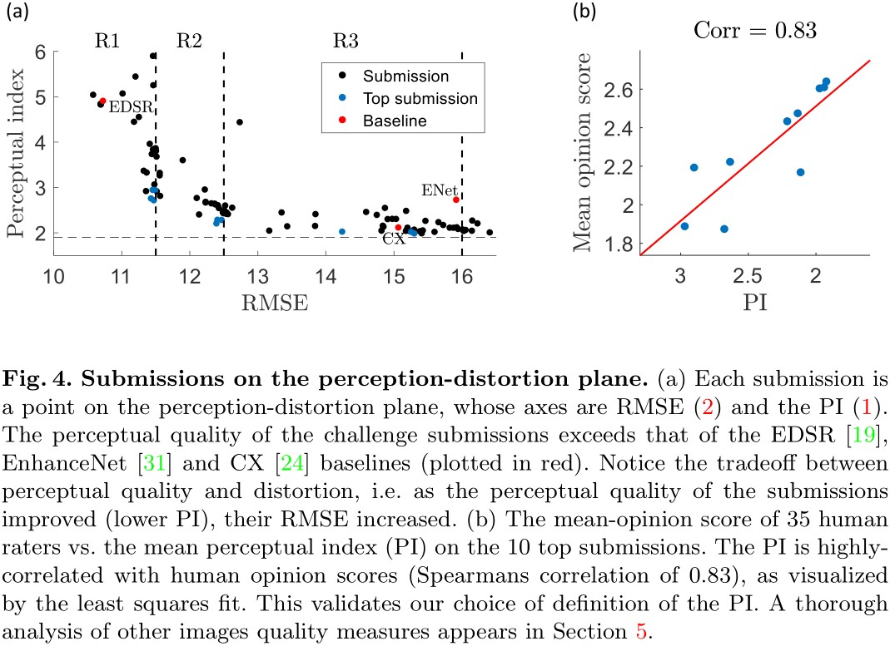

本次PIRM（Perceptual Image Restoration and Manipulation）是第一次提出用坐标系来刻画tradeoff的竞赛。

由于缺乏通用的评价指标，perceptual类的竞赛之前是不存在的。

竞赛数据集是bicubic下采样的。

竞赛指标为RMSE和PI。RMSE是测试集所有图像的MSE取平均后开根号，PI是：

$$
\text{PI} = \frac{1}{2} ((10 - \text{Ma}) + \text{NIQE})
$$

如此构造的PI是无参考的。

作者实验发现PI和主观分数MOS相关系数达到了0.83，挺高。

本文分析挑战结果，也指出：不是所有图像都是公平的（参见图8左），SR图像也有难易之分。

此外作者认为，现有的方法无法同时很好地重建texture和structure。如图8右，石雕强调structure，而大楼的texture更丰富。

如图，LPIPS在整体上和MOS分正相关，但在高MOS段是负相关。

## The Contextual Loss for Image Transformation with Non-Aligned Data

Contextual loss，ECCV 2018：风格迁移不存在pair data，如何训练GAN？进一步，如何实现特定区域的风格迁移，例如人脸？

- [tag] 风格迁移
- [tag] GANs
- [tag] 3 stars

> 20-10-31

通常GANs都依赖于pair data，因为loss需要刻画相似性。而本文提出不需要pair data的loss。

当时的loss分为三类：一类是pixel-to-pixel的，例如L2；另一类是global的，例如Gram loss；还有一类是GAN loss。

Gram loss可以用于unpaired或unaligned的数据，但它作用效果为整张图（我的理解为整张图片都有迁移风格）。有时我们只希望让特定区域被迁移，例如人脸。

本文方法简单粗暴：只监督特征的相似性，不考虑像素域相似性。

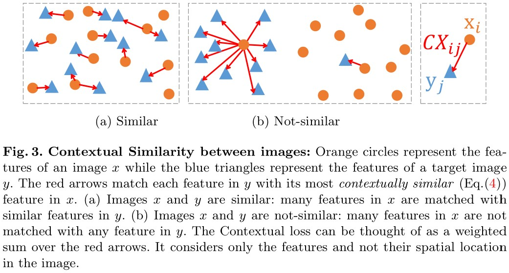

思路很直接，如上图。如果图像X和Y的大量特征都能一一接近，那么X和Y就是相似的；否则就是不相似的。例如在b中，大量x找不到配对y。

显然，最简单的刻画，就是每个y距离其最近x的距离，然后对所有y求和。如果用CX表示相似性，那么距离越近，相似性就越大，所以是max：

$$
\text{CX(X,Y)} = \frac{1}{N} \sum_j {\max_i} \text{CX}_{i,j}
$$

光是这样不行。我们希望这种相似性与整体距离无关，即，迁移风格可以出现在图像任意位置，而并不一定是原本的位置。经过式2和3操作，相似性w一定是在0和1之间；然后再用所有w之和进行归一化，使他们和为1。

相似性越低，loss越大，因此取负对数即可，如式5。

## HiFaceGAN: Face Renovation via Collaborative Suppression and Replenishment

HiFaceGAN，ACM 2020：本质上就是利用了UNet的编解码结构。

- [tag] 人脸图像增强
- [tag] GANs
- [tag] 3 stars

> 20-10-31

本文要解决人脸的盲增强。本文称自己为dual-blind，因为有的方法需要GT（single-blind），还有的方法需要先验（例如landmark和语义分割信息），但HiFaceGAN都不需要。

本文的对比算法中，ESRGAN引入了新的噪声，而其他算法几乎没有帮助。

结构上，G使用了UNet架构，确实能实现multi-stage效果。所谓suppression就是UNet的压缩通路，所谓replenishment就是UNet的解码通路。作者的故事：压制失真，恢复细节。

在细节上，一般卷积的问题是平移不变性。显然，背景和人脸区域最好有不同的处理。因此改进卷积为式2。为了体现对称性，干脆取其为自身内积。内积结果用来加权卷积。如图4。

解码模块使用SPADE。实际上和SPADE使用分割图很不一样，这是作者的故事罢了，并且增加了参数规模和学习能力。

在loss方面，采用了GAN loss，VGG预训练的perceptual loss和多尺度特征匹配loss[53]的组合。

由于HiFaceGAN不依赖于人脸先验，因此可以用于其他任务。

后记：本文的创新点堪忧。大部分都是之前GAN的工作。而且主观效果图也一般。

## Video Multi-method Assessment Fusion

[VMAF](https://netflixtechblog.com/toward-a-practical-perceptual-video-quality-metric-653f208b9652)，2016：Netflix商用视频质量评估方法。

- [tag] 无参考视频质量评估
- [tag] 4 stars

> 20-11-2

- [Blog1](https://netflixtechblog.com/toward-a-practical-perceptual-video-quality-metric-653f208b9652)
- [Blog2](https://netflixtechblog.com/vmaf-the-journey-continues-44b51ee9ed12)

在工作过程中，作者发现：他们接触的视频的编码格式、分辨率、内容太丰富了，很难用主观评价（Expert viewing）来评价视频质量。而PSNR、SSIM等离人类perceptual太远，这我们都知道。于是作者开始思考VMAF。

有几点要求：smooth video playback，低噪，在有限带宽和受限的设备下主观效果尽可能好。

有相当多的学者已经验证了VMAF的优越性：在4K，gaming等content上，VMAF和perceptual quality最为接近。VMAF甚至被用来决策最优编码策略。

## Image-To-Image Translation With Conditional Adversarial Networks

pix2pix，CVPR 2017：提出结合L1 loss和GAN loss，使GAN在保真情况下具有一定创造性。可能是第一篇用GANs做图像转换的。

- [tag] 图像转换
- [tag] GANs
- [tag] 4 stars

> 20-11-4

conditional GANs是输入随机噪声z，同时输入图像x，通过改变噪声，产生新的输出y。loss是GAN loss。

前人工作发现，加上L2 loss可以更保真。作者在本文中尝试用L1 loss，和L2相比不会过于模糊。

在conditional GANs的基础上，作者尝试去掉z，而直接输入x。结果发现，网络仍然能正常学习x到y的映射，但映射类似delta，是deterministic的，缺乏随机性。

加上z实际上也没有太好的效果，作者发现网络会学会忽略这一噪声z。

作者还尝试了用dropout产生噪声，结果发现随机性很小。这一问题仍然没有解决。

在网络设计上，生成器用的是UNet。这种信息传递结构对上色等任务非常重要。对于鉴别器，本文采用的是PatchGAN，即在patch上计算loss，再取平均，实验发现高频细节恢复效果更好。

## High-Resolution Image Synthesis and Semantic Manipulation With Conditional GANs

pix2pixHD，2018 CVPR：生成高分辨率图像。

- [tag] 图像转换
- [tag] GANs
- [tag] 语义分割信息
- [tag] 4 stars

> 20-11-4

以往的方法无法很好地生成高分辨图像。为了实现这个目标，作者提出了几点方法：

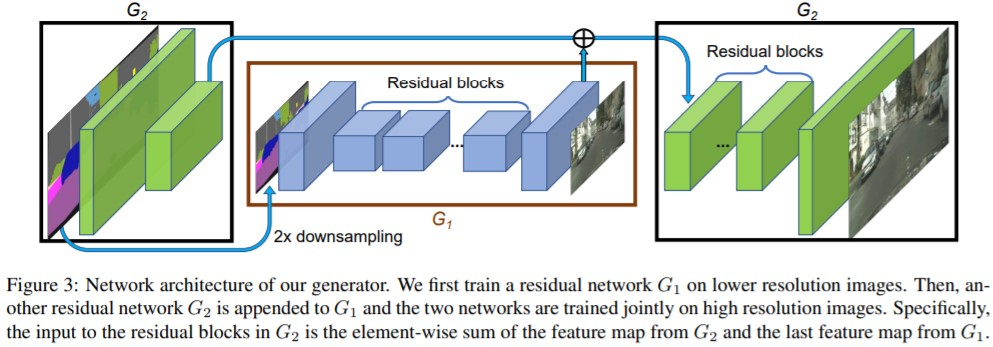

第一，设计两个生成器，小生成器G1建模global降采样的小图像，相关特征输入大生成器G2建模大图像。有点像UNet的思路。

第二，D在多尺度上衡量loss。G loss中除了perceptual和PatchGAN loss，还用feature matching loss替换了L2/L1 loss。即，输入鉴别器，计算特征的相似性。之所以不监督L1/L2，是不希望保真和平滑。

第三，用instance map而不是label，防止多个同类instance相邻导致map糊成一片。同时，instance map作为condition，可以使网络具有随机性，甚至可以编辑生成图像。

## Semantic Image Synthesis with Spatially-Adaptive Normalization

SPADE，CVPR 2019：同时控制style和semantic。

- [tag] 图像生成
- [tag] GANs
- [tag] 4 stars

> 20-11-4

作者称该方法为spatially-adaptive normalization。当提供图像语义信息时，可产生如图结果。

整体网络：

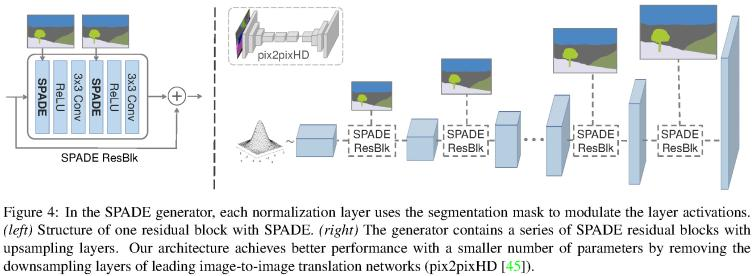

语义分割map会持续输入decoder。偶尔需要downsample以正常输入。

具体而言，SPADE就是一个对normalize后的feature map的仿射变换：

注意，SPADE的输入是分割图，即map是该所谓conditional GAN的输入条件。而一般的BN之类都属于无条件归一化。

起名为denormalize，实际上就是仿射变换。

为什么传统的条件输入方法无效？假设现在只有单类别，经过normalize和卷积后，就失去了所有信息（又变成0均值），因此输出是平凡的。参见第3页。

作者认为，encoder处理的是style，而SPADE处理的是semantic。因此，我们给图4加入encoder，输入为具有目标style的图片，那么输出图像就同时具有semantic和目标style。这就是为什么如图1可以在两个维度变换。

loss和pix2pixHD一样，除了将L2改为hinge loss。实验发现每一项loss都很重要，少一个都不行。监督器用的也是pix2pixHD中的multi-scale discriminator。

## TO-LEARN

- VMAF两个Blog。
- PULSE，一种较强的face recreation方法。
- The Perception-Distortion Tradeoff
- Once-for-all adversarial training
- GANs Trained by a Two Time-Scale Update Rule Converge to a Local Nash Equilibrium，2000+ stars. FID可以了解。
- DFNet，人脸盲增强。试试复现。
- cv2对DCNv2的解析，看看如何做实验的。
- AIWalker历史公众号，都是经典文章。
- 何凯明暗通道分析方法。
