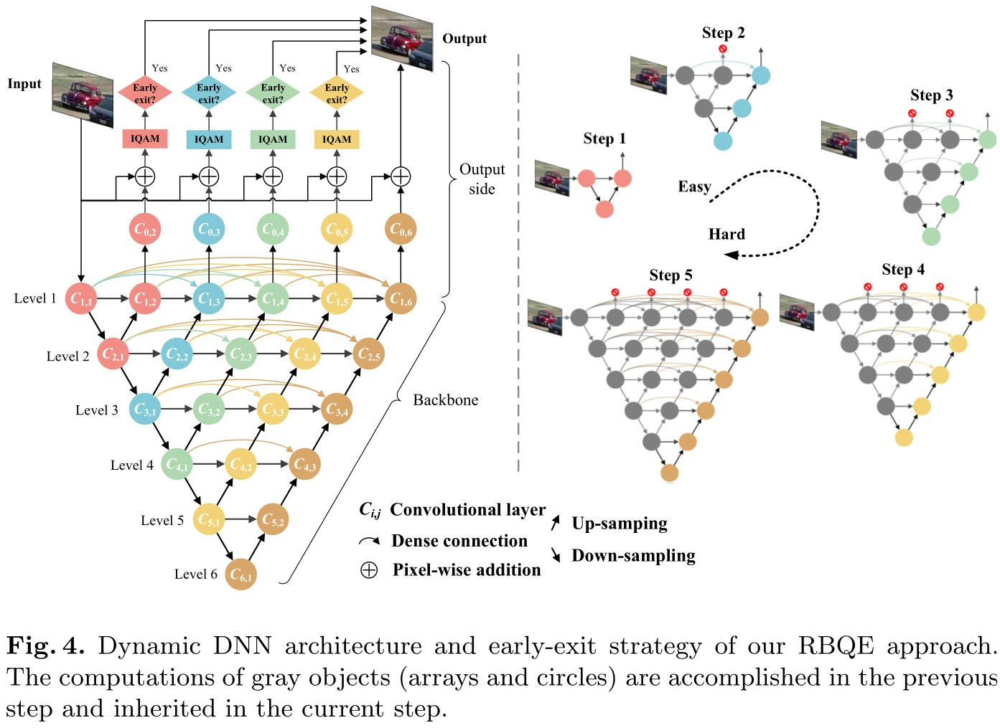

# 论文速览：*Early Exit or Not: Resource-Efficient Blind Quality Enhancement for Compressed Images*（ECCV 2020）

- [论文速览：*Early Exit or Not: Resource-Efficient Blind Quality Enhancement for Compressed Images*（ECCV 2020）](#论文速览early-exit-or-not-resource-efficient-blind-quality-enhancement-for-compressed-imageseccv-2020)
  - [1. 初衷](#1-初衷)
  - [2. 思路进化](#2-思路进化)
  - [3. 网络设计和训练方法](#3-网络设计和训练方法)
  - [4. 质量判别](#4-质量判别)
  - [5. 实验](#5-实验)

[[PAPER]](https://github.com/RyanXingQL/RBQE) [[CODE]](https://github.com/RyanXingQL/RBQE)

## 1. 初衷

在19年[[MFQEv2]](https://github.com/RyanXingQL/MFQEv2.0)的工作中，我们要针对不同失真类型的压缩视频，训练同一结构、不同参数的深度网络模型。例如，对于HEVC压缩的5种典型配置（固定QP为22，27，32，37，42），我们需要训练5个深度网络模型。

这种训练思路会导致两个实际问题：

- 资源浪费：特别是当输入失真类型差异较大时（例如用户上传的UGC），所需特定模型较多。
- 非盲增强：由于每一个模型都对应一种特定的失真，因此我们必须提前获知输入的失真类型，再匹配模型；而实际场景中存在大量失真内容/失真程度未知的压缩视频。

那么，有没有可能，使用单一模型，对付多种失真视频？具体而言，能否设计一种网络，既能够判断自动失真类型，又能够健壮地增强各式各样的失真视频？

## 2. 思路进化

为了简化问题，我们先在压缩图像上实现我们的构思。

上面提到的思路本质上属于“伪盲”：我们只能限定若干种失真，然后再对输入图像进行判别，最后再将输入图像送入对应的增强支路。采用这种思路的[[paper]](https://ieeexplore.ieee.org/abstract/document/8653951/)已经有了，和非盲增强的框架相比，只是多了一个判别器，并无新意。

此时我有了新的思路：设计一种渐进增强的网络，并且在增强的过程中，对已增强图像的质量进行判断；如果质量不错，那么就提前退出。这样做有几点好处：

- 做到了真正的盲增强：无需限定可处理的失真类型。
- 和思路1相比，更符合实际需求：已增强图像达到了既定目标，才能被输出。现实中我们往往也是对图像的质量有所要求。
- 节约资源：由于存在提前退出机制，因此简单图像可以简单增强。

这么做带来了全新的挑战：

- 如何设计高效的渐进盲增强网络？
- 如何判别图像质量？

我来详细说说。

## 3. 网络设计和训练方法

我很快联想到了大量网络剪裁、网络加速的相关工作。在图像分类任务中比较典型的有黄高老师的[[MSDNet]](https://arxiv.org/pdf/1703.09844.pdf)和[[SkipNet]](https://openaccess.thecvf.com/content_ECCV_2018/html/Xin_Wang_SkipNet_Learning_Dynamic_ECCV_2018_paper.html)。两个工作有一点明显的区别：

1. MSDNet在训练过程中完全不区分难易样本，而是简单地执行深监督（所有样本在所有出口的loss权重都是1，然后求和）；在测试阶段，设置一个输出阈值，当某样本在某出口的分类阈值达到输出阈值时，即可在当前出口输出。
2. SkipNet是在训练分类网络的同时，还训练一个基于RL的skip判别器；训练的loss不仅包括分类准确率，还包括消耗资源的测度。

两种策略很难说孰优孰劣。

1. 前者在训练时完全不考虑难易，而只是在网络设计中减缓分类器之间的串扰（详见MSDNet论文中的多层结构），并且测试阶段阈值的选取也是主观的。
2. 后者在设计loss时也需要人为设定性能和资源的tradeoff，并且训练分好几个阶段，比较复杂。

作为压缩图像盲增强的第一个工作，为了简单起见，我决定采用思路1，并给出了如下网络设计，如图：

有三点说明：

- 难、易图像的增强，在前处理阶段可以共享，我们称之为“编码”；而在后处理阶段，即所谓的“解码”时，我们最好给难、易样本提供各自的处理支路，让网络更好地处理差异。因此在整体上，我采用了如图所示的嵌套U-Net结构：其编码主干（也就是下采样的主干）是渐进共享的，而解码支路（也就是上采样的5个支路）各走各的。
- 在此基础上，我增加了稠密连接，来进一步降低资源消耗：支路之间的连接强度是可学习的，因此引入稠密连接利大于弊。
- 由于衡量能耗的指标选为FLOPs，为进一步降低FLOPs，整体网络大量使用separable convolution；虽然FLOPs表现很优异，但耗时上表现一般（和对比算法相比）。

RBQE的训练方法和MSDNet基本是一致的。不同的是，我在训练阶段也稍微考虑了图像的难易。例如，对于高QP（低质量）的样本，我鼓励它深度增强（后退出），因此其loss在深出口的权重要更大（对网络后端的改善会更明显）；反之，对于低QP（高质量）的样本，我鼓励它简单增强（先退出），因此其loss在浅出口的权重要更大（迫使网络在较浅时即可达到较好的增强效果）。

遗憾的是，尽管我们不需要明确指出失真类型（参考我前面批评伪盲增强的部分），但训练时仍必须制备若干种类型的失真图像，并且为它们分配出口权重（可同可不同）；而且出口权重的设置也是主观的。

## 4. 质量判别

在[[MFQEv2]](https://github.com/RyanXingQL/MFQEv2.0)和相关工作中，PSNR和SSIM是主要的质量评价指标，因此本文也沿用了该指标（实际上，我最近也在研究感知质量指标，因为感知质量更贴合实际需求）。

比较困难的一点是：PSNR是FR IQA指标，而RBQE是无参考的盲增强方法，无法获取参考图像。这就要求，我们的质量评估方法在压缩图像上的趋势，应尽可能逼近PSNR和SSIM。

具体的IQA设计见论文，思路：

1. 我们对压缩图像中的模糊和块效应都比较敏感，特别是发生在平滑区域的块效应，以及发生在纹理区域的模糊。
2. 那么，我们对图像分块，然后逐块二分类。
3. 对于平滑块，我们评估块效应强度，具体指标是切比雪夫矩中的特定方向能量；对于纹理块，我们评估模糊强度，具体方法是对当前块进行二次模糊，比较前后的矩相似性；如果相似性高，说明原本块就很模糊。
4. 最后，我们二者进行归一化和加权组合。由于我们对前者更加敏感。因此前者权重较大。

虽然该盲IQA模块具有大量超参数，但经过我在QP等于22、27、32、37、42的图像上实验，IQA输出结果和PSNR、SSIM趋势相同，因此较为完美地完成了盲质量评估的既定目标：

## 5. 实验

无论是以PSNR和SSIM为指标的质量增强，还是以FLOPs为指标的资源节约，上述方法在HEVC压缩图像以及JPEG压缩图像上都取得了较好的效果，如图：

进一步我想考察，RBQE究竟是否达到了tradeoff意义上的最优。首先，在输出阈值的选择上，我们根据下图左的结果，选择了拐点（在实际场景中应根据条件和需求确定）。

在右图中，我们迫使HEVC压制的每一种QP的图像，分别从5个出口都输出，并测量其PSNR结果。例如对于QP等于27的图像，我们能明显看到，其在出口2输出是最为理想的；当在出口3、4、5输出时，PSNR无法获得明显提升，而能耗稳定增加。

综上，在当前的训练策略下，RBQE的盲增强性能和节能情况均能超越对比算法，并且实现了既定的tradeoff思想。RBQE作为相关领域的第一篇工作，训练方法简单，思路清晰；但我认为RBQE还有较大的缺憾，还希望在今后的工作中加以讨论和改善。主要有几个方面：

1. 改进训练方法，使得难易样本的训练更和谐统一。
2. 更好地刻画难易样本（不能简单地根据图像的压缩QP，而应根据网络增强情况或实际需求）。
3. 考虑如何在盲增强中尽可能剔除主观设计因素。这一点尤为困难，既要深度网络的性能优势，又想抛弃深度网络的“死板”（深度网络有时不如传统方法健壮和自适应，因此衍生出一系列dynamic network的工作）。
4. 考虑其他更实际的质量评估指标代替PSNR和SSIM，相应地质量评估方法也要有所变化。

欢迎关注、讨论以及改善RBQE方法！
