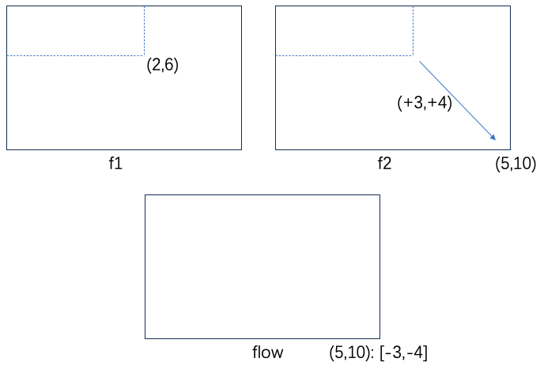
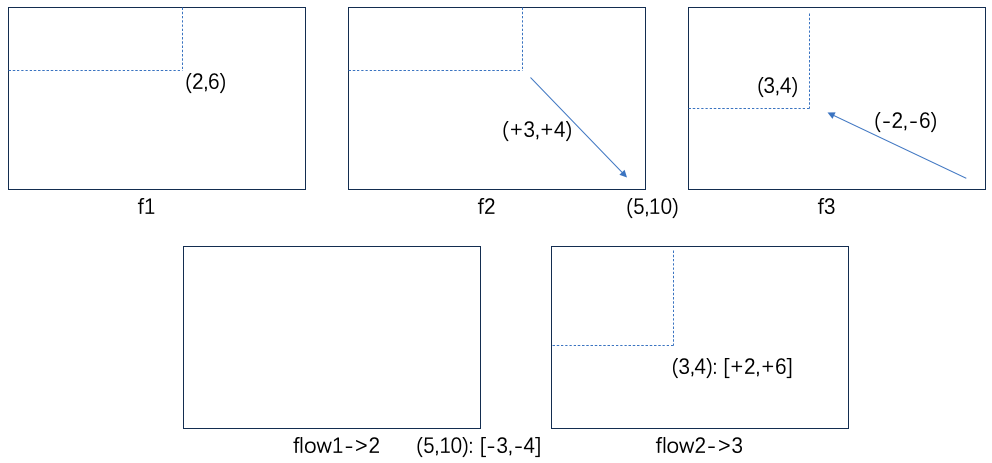

# 如何用一阶光流模拟二阶光流

本文讨论 MMEditing 中的 SPyNet 光流 和 `flow_warp` 方法。

## 理解一阶光流

假设我们有一个 3 帧序列，由 f1、f2、f3 组成。我们先看看将 f1 变形（warp）到 f2 的时间戳上要怎么做。

```python
flow = spynet(ref=f2, supp=f1)  # (n, 2, h, w)
f1_2 = flow_warp(x=f1, flow=flow.permute(0, 2, 3, 1))  # flow_warp 要求 (n, h, w, 2) 输入，因此 permute
```

先解释下 `flow` 长什么样。假设 `f1[2,6]` 移动到了 `f2[5,10]`；那么 `flow[0:2,5,10] = [-3,-4]`。



即，

- `flow` 将用两个通道分别记录 $\\Delta y$ 和 $\\Delta x$。
- `flow` 记录的坐标以 `f2` 为中心，数据以 `f1` 为中心。因此，该位移数据记录在 `[5,10]`；`f2[5,10]` 的数据需要从 `f1[2,6]` 即 `f1[5-3,10-4]` 去找，因此 $\\Delta y = -3$，$\\Delta x = -4$。

为什么要从 `f2` 溯源至 `f1`？因为在 `flow_warp` 函数中是这么操作的：

```python
grid_flow = grid + flow
...
output = F.grid_sample(
  x,
  grid_flow,
  mode=interpolation,
  padding_mode=padding_mode,
  align_corners=align_corners)
```

- 把 `grid` 理解为 `f2` 的坐标 $(y,x)$，`flow` 就是 $(\\Delta y, \\Delta x)$；那么 `grid_flow` 就是 $(y + \\Delta y, x + \\Delta x)$，就是溯源至 `f1` 的坐标。
- 所谓 `f1` 变形至 `f2` 的时间戳，就是生成一张和 `f2` 一样大的图 `f1_2`；`f1_2` 中每个点的数据要根据 `grid_flow` 提供的实际坐标溯源 `f1`。

由于 `f1` 提供实际数据支撑，因此被 `spynet` 称为 support 参数；`f2` 辅助变形对象 `f1` 提供溯源坐标参考，因此被称为 reference 参数。

## 用一阶光流模拟二阶光流

假设如图情形：



我们希望用 `flow1_2` 和 `flow2_3` 模拟 `flow1_3`。简单而言，就是如何让 `flow1_3[0:2,3,4] = [2-3,6-4] = [-1,2]`。

先公布答案：

```python
flow1_3 = flow2_3 + flow_warp(flow1_2, flow2_3.permute(0, 2, 3, 1))
```

- 在 `f3` 溯源至 `f1` 时，`flow2_3` 可以直接使用，因为其溯源坐标以 `f3` 为中心；但`flow1_2` 不能直接使用，因为其溯源坐标以 `f2` 为中心。
- 以上图为例。我们希望得到 `f1_3[3,4]` 的值（我们知道是 `f1[2,6]`），首先根据 `flow2_3` 追溯到 `f2[5,10]`；但最终目标是 `f1[2,6]`；`flow1_2[5,10]` 提供了准确的位移 $(-3,-4)$，但由于服务于 `f1_3[3,4]`，因此要出现在坐标 $(3,4)$ 而不是坐标 $(5,10)$ 上；因此将 `flow1_2` 根据 `flow2_3` 变形即可（由于 `flow2_3[3,4] = [+2,+6]`，因此 `flow1_2_2_3[3,4] = flow1_2[3+2,4+6] = flow1_2[5,10]`）。
